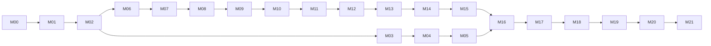

# BeadsHX Complete Port and Production Qualification PRD

## 1. Document status and authority

**Status:** Proposed implementation PRD for Codex reconciliation and execution
**Owner:** requester
**Program name:** BeadsHX
**Development binary:** `bdhx`
**Future coordination layer:** Brew, above TaskPort
**Primary compatibility target:** Beads v1.2.1
**Pinned upstream commit:** `634cbbc4bc580fa5124f63fdf65d137a46d5b4ff`
**Reference haxe.go release:** v0.54.0
**Reference haxe.go commit:** `92d458e760a30bcb57f2cefb6202f0996fe1ac71`
**Required Haxe line:** Haxe 4.3.7
**Required Go line for the pinned Beads target:** Go 1.26.5

This PRD is the program specification. It does not override newer accepted repository architecture or active work without reconciliation. Codex must inspect the live Git and Beads state before it mutates issues or code.

The uploaded Repomix snapshots were useful for architecture analysis. They exclude `internal/**`, license files, and other important content. They are not sufficient implementation sources. The implementation must use the complete repositories.

### Source facts used by this PRD

- The pinned Beads release is MIT-licensed and has a large Go dependency graph, Dolt storage, CGO and server modes, a broad Cobra CLI, migrations, backups, sync, integrations, and release packaging for multiple operating systems and architectures.
- The attached Beads source identifies version 1.2.1 and Go 1.26.5. Its canonical embedded build uses `CGO_ENABLED=1`, the `gms_pure_go` build tag, and linker-injected build metadata. Server/no-CGO release profiles use different explicit settings.
- The attached command layer contains more than 400 non-test Go files under `cmd/bd`; most core implementation is under the excluded `internal/**` tree.
- haxe.go v0.54.0 is a pre-1.0 compiler release. Its admitted release scope is narrower than BeadsHX needs. Its current standalone build path writes `go.mod` and runs a fixed `go build .` unless code-generation-only mode is selected.
- haxe.go has an approved generated-output policy. The compiler remains GPL-3.0-only. User code and project-owned generated/runtime portions can be distributed under the approved generated-output terms. The implementation must preserve all required notices and verification.
- Cafetera already defines Beads as the mutable task authority, TaskPort as the neutral operation boundary, Brew as an optional selection/context/verification/recovery layer, and graph views as rebuildable projections. Existing live Caf work must be extended, not replaced.
- The attached Caf binding still names an older Beads v1.0.4 source lock and already has a tested read-before/write/read-after writer seam. M19 must migrate the source/provider choice explicitly and reuse the existing seam.

## 2. Executive decision

Build BeadsHX as a compatibility fork of the pinned Beads release.

Haxe will own the application and product semantics:

- domain types and validation;
- command definitions and handlers;
- lifecycle and relation rules;
- typed error and output behavior;
- application services and ports;
- TaskPort provider behavior;
- shared neutral contracts;
- future Brew policy and coordination logic.

Go will keep the parts where Go already has the correct production machinery:

- Dolt and its driver;
- `database/sql` implementation details;
- CGO and platform toolchains;
- selected Go libraries and SDKs;
- Cobra parsing/help/completion host code;
- small typed facades for callbacks, interfaces, pointers, concurrency, and platform APIs.

This is a port of ownership and behavior. It is not a mechanical translation of each Go file.

The first release binary is `bdhx`. It uses the same Beads database and workspace conventions. It must not create a second task store or a `.beadshx` authority. During the program, the pinned upstream binary remains available as `bd-upstream` or an equivalent explicit name.

Brew is not a rename for the database. Brew is a separate package above TaskPort. BeadsHX must remain fully useful when Brew is absent.

## 3. Product thesis

Beads is a strong production test for haxe.go because it combines a large typed model, a broad CLI, real persistence, Git and filesystem effects, network services, concurrency, CGO, migrations, recovery, and cross-platform release engineering.

The program must prove two claims:

1. Haxe can author and safely control a production Go application while it continues to use the Go ecosystem.
2. The Haxe-owned structure makes large application behavior easier to type, modify, test, integrate, and reuse than an equivalent raw-Go application layer.

A successful build alone does not prove either claim. The program must measure behavior, data safety, build quality, development ergonomics, native-boundary size, and real feature work.

## 4. User problems

Marcelo depends on Beads as the backbone of his development workflow. Today, important task semantics and extension points are owned by an external Go codebase. This creates four problems:

- Caf integration must wrap a native system whose types and application behavior are not Haxe-owned.
- Changes for the Caf graph, TaskPort, agent workflows, and future Brew can require Go-specific implementation work.
- haxe.go has not yet been qualified against an application of this size and operational risk.
- The workflow depends on upstream product and architecture choices that Marcelo does not fully control.

BeadsHX must improve control without weakening data safety or cutting the project off from upstream Beads and the Go ecosystem.

## 5. Goals

1. Produce production-quality Go binaries from Haxe-authored application code.
2. Preserve complete Beads v1.2.1 behavior and data compatibility.
3. Preserve upstream Beads databases, histories, revisions, imports, exports, backups, sync, and recovery.
4. Consume Dolt and other independent Go libraries through precise Haxe
   externs while porting all first-party Beads implementation code to Haxe.
5. Make every required native boundary visible, measured, tested, and replaceable where practical.
6. Make common Beads features easier to change through typed Haxe domain and application code.
7. Provide a first-class TaskPort provider for Caf without moving task truth into CML or the graph.
8. Create Brew later as one reusable package above neutral TaskPort and WorkContext contracts.
9. Retain direct native debugging, upstream comparison, backup restore, and rollback paths.
10. Establish a repeatable method to absorb future upstream Beads releases.

## 6. Non-goals

- Do not reimplement Dolt.
- Do not replace Beads storage with CML or the Caf graph.
- Do not make Brew the task database.
- Do not make BeadsHX require Caf.
- Do not copy live task fields into authored CML.
- Do not add orchestration policy to Beads core to simplify Brew.
- Do not mechanically translate files or preserve Go package layout when it does not serve the Haxe design.
- Do not reimplement independent third-party libraries merely to remove Go. A
  small native island is acceptable only for a proven third-party or platform
  boundary that precise externs and a reusable haxe.go improvement cannot
  represent safely. Upstream Beads Go code is never such an island.
- Do not claim full compatibility from a daily-workflow subset.
- Do not claim a platform from successful cross-compilation alone.
- Do not test early writes on primary task databases.
- Do not silently fix upstream behavior and still label it byte-for-byte compatible. Record deliberate divergences.

## 7. Terms

**Upstream oracle:** The exact pinned `bd` binary used to observe expected behavior.
**Candidate:** The `bdhx` binary produced from Haxe, haxe.go output, and approved standard-library or independent third-party Go boundaries.
**Differential test:** The same controlled scenario run against the oracle and candidate, followed by process and state comparison.
**Native island:** A small, typed Go facade for a proven independent third-party
library, platform, callback, or runtime feature. First-party Beads Go code is
porting source and cannot qualify as a native island.
**Logical state:** User-relevant database and workspace facts, not only printed output.
**TaskPort:** The narrow provider-neutral task boundary used by Caf and Brew.
**Beads graph:** Beads-owned task, dependency, hierarchy, gate, and relation behavior exposed by native commands.
**Caf graph:** A rebuildable cross-system projection. It can show Beads facts but cannot mutate them.
**Brew:** Selection, context, verification, closeout, recovery, and receipt policy above TaskPort.
**Compatibility divergence:** An intentional, visible difference from the pinned upstream release.
**Production profile:** A command, mode, and platform combination that passed its complete gate.
**Primary database:** A task database used for real work and not created as a disposable test fixture.

## 8. Definition of complete

The program is complete only when all of these statements are true:

1. The exact Beads v1.2.1 command inventory is fully accounted for.
2. No release command is delegated to the upstream binary.
3. Process behavior is compatible: parsing, help, output, JSON, errors, exit codes, signals, terminal behavior, and completion.
4. Persistent behavior is compatible: task state, dependencies, comments, events, metadata, revisions, files, hooks, Git effects, backups, migrations, sync, and recovery.
5. Upstream `bd` and `bdhx` can alternate reads and writes on the same supported database without repair.
6. Haxe owns domain rules, command handlers, application services, and public BeadsHX behavior.
7. Every native Go island is approved, typed, tested, documented, and free of hidden application policy.
8. Generated Go passes the required Go build, format, test, static, race, security, license, and provenance gates.
9. The complete declared platform matrix is qualified. Partial profiles are clearly labeled.
10. Caf can use BeadsHX through TaskPort with native readback and rebuildable graph projections.
11. Brew works above neutral TaskPort against BeadsHX and a second conformance provider, and BeadsHX works when Brew is removed.
12. A staged dogfood, backup, restore, cutover, rollback, and forward-cutover drill has passed.
13. BeadsHX 1.0 artifacts, source, generated source, SBOM, licenses, compatibility report, and recovery documentation are published from one exact release commit.
14. Future upstream changes enter a controlled delta and requalification process.

A visible owner-approved divergence can remain in a 1.0 release. It must not be hidden. It must include user impact, tests, migration effect, platform effect, rationale, and rollback information.

## 9. Authority and ownership model

| Concern | Authority | BeadsHX rule |
|---|---|---|
| Mutable tasks, comments, relations, history, native revisions | Beads-compatible native database | Haxe requests operations through typed ports; native readback proves results. |
| Haxe domain and application behavior | `src/beadshx/**` | This is the preferred source for product behavior. |
| Go standard library, Dolt driver, CGO, platform, selected independent SDK behavior | Precise Haxe externs, with exceptional reviewed native islands | Haxe owns their lifecycle and Beads-facing behavior; native code is limited to an otherwise unrepresentable third-party or platform mechanism. |
| Generated Go | haxe.go output manifest | Disposable build material. Never hand edit it. |
| CLI parsing/help/completion mechanics | Haxe-authored command surface over Cobra externs where Cobra remains useful | No first-party Beads Go command or host implementation remains in the release path. |
| Compatibility truth | Pinned upstream oracle plus differential evidence | Documentation cannot mark a surface green without its evidence. |
| Caf authored integration intent | CML/module/workspace binding | It can select exact providers and policy. It cannot claim live task or host facts. |
| Caf graph/headless views | Derived projections | Delete and rebuild. Never mutate task authority. |
| Task selection/context/verification/recovery | Brew above TaskPort | Optional. It does not own task facts. |
| Issue tracking for this program | Live Beads database | Do not create Markdown TODO lists as a competing tracker. |

## 10. Target architecture

```text
                         optional Caf and Brew

  Caf CML binding ──> TaskPort contracts <── Brew core policy
                            │                       │
                            │                       └── WorkContext / verification /
                            │                           closeout / recovery / receipts
                            v
                    BeadsHX TaskPort provider
                            │
                     Haxe application core
        ┌───────────────────┼─────────────────────┐
        │                   │                     │
   command handlers     domain rules       output / diagnostics
        │                   │                     │
        └───────────────────┼─────────────────────┘
                            │ typed ports
                            v
       precise standard-library / third-party Go externs
        ┌───────────────────┼─────────────────────┐
        │                   │                     │
       Cobra           Dolt / SQL driver       platform/SDK
        │                   │                     │
        └───────────────────┼─────────────────────┘
                            v
                    Dolt / SQL / Git / OS
```

### 10.1 Dependency law

Allowed:

```text
brew-core -> taskport-contracts
brew-beadshx-provider -> brew-core + beadshx-taskport-provider
beadshx-application -> beadshx-domain + typed ports
beadshx-generated-go -> Go standard library + independent third-party packages
cafetera -> published contracts/provider/module assets
```

Forbidden:

```text
beadshx-domain -> Dolt, SQL, Cobra, Caf graph, Brew
beadshx-storage-facade -> Brew policy
TaskPort core -> provider-specific metadata bag
Caf graph -> direct task mutation
Brew -> raw Beads database access
native Go facade -> hidden issue-selection or closeout policy
beadshx release -> upstream Beads first-party Go packages
```

### 10.2 Native-island admission test

A native Go island is allowed only when all answers are recorded:

1. Which Go or platform feature requires it?
2. Why is a direct typed haxe.go representation not safe or useful now?
3. What is the smallest Haxe-facing API?
4. Which inputs, outputs, errors, effects, cancellation, and concurrency rules cross it?
5. Which tests prove it?
6. Does it contain product policy? The answer must be no.
7. What evidence could remove or shrink it later?
8. Which license and notice obligations apply?
9. Is the implementation independent third-party or platform code rather than
   upstream Beads first-party code? The answer must be yes.

### 10.2.1 Haxe and native profile policy

Keep all first-party Beads domain, validation, codecs, commands, storage
coordination, transactions, configuration, sync, integration, and application
services in authored Haxe. Represent Go standard-library and independent
third-party APIs through precise externs. Put an exceptional Go-specific facade
in an explicit `@:goNative` module only after a reduced fixture proves that a
reusable compiler or SDK improvement cannot safely express the boundary.
Release builds reject upstream Beads first-party Go imports and unapproved
native imports, and application source contains no raw `__go__`.

### 10.3 Command architecture

Define parsing, help, shell completion, terminal behavior, command meaning, and
handlers in authored Haxe. Haxe can call Cobra as an independent third-party
library through precise externs when that preserves compatibility. If callbacks
or command-tree APIs expose a reusable haxe.go gap, fix the compiler or SDK
before continuing; do not retain an upstream Beads Go host as a shortcut.

A development-only upstream fallback can help dogfood unported commands. It must be explicit, logged, disabled by default, and impossible in release qualification.

### 10.4 Storage architecture

Port upstream Beads storage and unit-of-work behavior to typed Haxe capability
ports. Reach `database/sql`, the Dolt driver, CGO shims, and other independent
libraries directly through precise externs; do not retain upstream Beads
`internal/storage`, `issueops`, domain, or UOW implementations in release paths.

Haxe owns begin, commit, rollback, retry, resource lifetime, error mapping, and
Beads transaction policy. Native libraries own only their documented runtime
mechanics. A reusable haxe.go or SDK gap found while expressing this boundary
is fixed in haxe.go before BeadsHX advances its compiler lock.

### 10.5 Suggested repository layout

```text
beadshx/
  AGENTS.md
  docs/
    architecture/
    decisions/
    compatibility/
    operations/
    releases/
  src/beadshx/
    domain/
    application/
    commands/
    ports/
    protocol/
    diagnostics/
    taskport/
  packages/
    taskport-contracts/
    work-context-contracts/
    brew-core/                 # M20 only
    brew-beadshx-provider/     # M20 only
  native/go/
    cmdhost/
    storagebridge/
    platformbridge/
    integrationbridge/
  generated/go/                # compiler-owned; usually not committed
  compatibility/
    command-manifest.json
    cases/
    normalizers/
    schemas/
    reports/
  test/
    unit/
    semantic/
    parity/
    persistence/
    recovery/
    migration/
    performance/
    platform/
    fixtures/
  caf/
    provider-manifest/
    examples/
  upstream/                     # scripts/locks, not a second mutable authority
  build/
  release/
```

The exact paths can change during repository reconciliation. The ownership split must not change without an ADR.

## 11. Compatibility contract

Each command/capability record must include:

```text
identity
  upstream release and command path
  aliases and hidden status

inputs
  argv and flags
  stdin and terminal mode
  environment and configuration
  workspace/storage mode
  platform

outputs
  stdout and stderr contracts
  JSON schema and ordering
  exit code and signals
  warnings, prompts, progress, and colors

state
  transaction class
  logical database changes
  history/events/revisions
  filesystem/Git/network effects
  rollback and recovery

implementation
  Haxe owner
  native facade owner
  generated/runtime features
  native-boundary report

evidence
  unit and semantic tests
  differential cases
  persistence/recovery cases
  platforms
  status and divergence/waiver
```

Compatibility is behavioral. Internal implementation does not have to match upstream. However, any internal change that affects public or persistent behavior must be visible in the contract.

### 11.1 Source and library compatibility

CLI, wire, data, and operational compatibility are mandatory. Source-level compatibility with the upstream Go import path is not automatic because BeadsHX uses a different module identity and Haxe becomes the application source of truth.

M02 must inventory documented external Go APIs and real consumers. M16 must provide and test useful compatibility wrappers or replacement APIs. The release must state which APIs are source-compatible, behavior-compatible under a new import path, replaced by Haxe packages, or intentionally unsupported. It must not use the phrase "full compatibility" to imply an untested Go source API.

## 12. Differential test design

For each scenario:

1. Create two identical disposable workspaces from one hashed fixture.
2. Run the upstream oracle against one workspace.
3. Run `bdhx` against the other workspace.
4. Capture raw exit code, stdout, stderr, signals, duration, resources, files, process effects, and native revision.
5. Apply only scenario-approved normalizers.
6. Compare process output.
7. Compare logical database and workspace state.
8. For writes, read the result with the opposite binary.
9. Retain a minimized evidence bundle on failure.
10. Destroy the fixture and verify no leaked process, port, lock, or temp file.

A normalizer must name exact fields. It cannot remove unknown JSON keys, arbitrary lines, errors, or database differences.

### Required fixture families

- empty directory and no workspace;
- fresh empty workspace;
- one issue with all core fields;
- hierarchical IDs and ambiguous short IDs;
- dependency chain, wide DAG, hierarchy, and rejected cycle;
- ready, blocked, deferred, closed, stale, orphaned, duplicate, and conflicting tasks;
- comments, events, history, metadata, memories, formulas, molecules, wisps, and gates;
- large Unicode and multiline values;
- 16k and 100k issue scale fixtures;
- current, old, newer, malformed, and interrupted schema states;
- backup, restore, compact, prune, purge, and corruption fixtures;
- embedded, no-CGO, server, proxied, multi-writer, multi-clone, remote, conflict, and federation fixtures;
- Git, Git-free, worktree, hooks, permissions, path, line-ending, and platform fixtures;
- recorded external-integration fixtures;
- pseudo-terminal interactive fixtures;
- injected process, disk, permission, network, cancellation, panic, and commit failures.

## 13. Production quality gates

### Haxe gate

- Haxe 4.3.7 and locked dependencies.
- No unapproved `Dynamic`, `Any`, `Reflect`, `untyped`, unchecked cast, or raw Go injection in application/domain code.
- One primary public type per file where practical.
- Algebraic variants and exhaustive switches for closed states.
- Typed outcomes and stable diagnostics for expected failures.
- Beginner-readable HxDoc for public and non-obvious boundary functions.

### Go gate

- Generated and native Go are `gofmt` clean.
- Required `go test`, `go vet`, static analysis, dependency guards, and race tests pass.
- Native islands contain no hidden application policy.
- Build tags, CGO, ldflags, package targets, and environment are explicit and recorded.
- The compiler never changes caller-owned `go.mod` or `go.sum` in embedded mode.

### Data gate

- Cross-binary read and write compatibility.
- Atomic claims and conditional updates.
- Transaction rollback and cancellation.
- Schema and migration safety.
- Verified backup and restore.
- Crash/fault recovery.
- Sync/conflict and concurrent writer correctness.
- Native revision and postcondition readback.

### Release gate

- Exact source and toolchain locks.
- Compatibility and platform manifests.
- SBOM, licenses, third-party notices, provenance, checksums, and signatures/attestations.
- Reproducible or explained build comparison.
- Install, upgrade, rollback, uninstall, and recovery documentation.
- No delegated command or hidden waiver.

## 14. Haxe value measurements

The program must measure whether Haxe improved control:

- percentage of command handlers owned by Haxe;
- percentage of domain/application policy owned by Haxe;
- native Go island count and size trend;
- unapproved/approved Dynamic boundary count;
- number of raw Go escape hatches;
- clean and incremental build times;
- generated file count and largest file;
- Go compile memory and tool responsiveness;
- time and files changed for representative new features;
- defect localization quality from Haxe and generated Go diagnostics;
- shared type reuse with TaskPort, Caf, and Brew;
- compiler defects found by BeadsHX;
- BeadsHX defects caused by compiler lowering;
- maintenance effort for an upstream Beads delta.

The desired result is not a line-count target. The required result is that all application policy is Haxe-owned and each remaining Go island has a clear native purpose.

## 15. Milestone execution rules

- A milestone starts only when its dependencies and entry evidence are current.
- Each task becomes one live Beads issue or a small stack of issues when repository layer rules require separate PRs.
- One PR should normally change one semantic layer. A storage primitive and a command integration should be stacked, not mixed into one large PR.
- Port vertical behavior slices. Do not translate directories in bulk.
- Every user-visible command slice includes domain behavior, native adapter, CLI integration, output, error, persistent-state comparison, tests, docs, and compatibility manifest update.
- Generated Go does not count as reviewed source. Review Haxe, native facade, compiler contract, and resulting behavior.
- A green process exit never proves a mutation. Use native readback and logical state comparison.
- A compatibility failure is a real product finding until the upstream oracle, fixture, or normalizer is proved wrong.
- If a haxe.go defect is general, fix and qualify it in haxe.go. Do not hide it in BeadsHX.
- If a Beads defect is independent of Haxe, reproduce it with stock upstream first. Preserve attribution and decide whether to upstream the fix.
- Preserve unrelated dirty work, active issue claims, comments, history, and newer architecture.

# Milestones and tasks

The backlog starts at M00 and ends at M21. The critical path is intentionally strict. Compiler enablement, application compatibility, data safety, platform release, Caf integration, and Brew are separate evidence lanes.



Some work can overlap. A later gate cannot use overlap to claim completion before its dependencies pass.

## Milestone summary

| Milestone | Outcome | Depends on | Tasks |
|---|---|---|---:|
| `M00` | Authority, source locks, and safety baseline | None | 10 |
| `M01` | Repository and program bootstrap | `M00` | 10 |
| `M02` | Complete behavior, data, and dependency inventory | `M01` | 11 |
| `M03` | haxe.go existing Go project mode | `M02` | 9 |
| `M04` | haxe.go production interop foundation | `M03` | 11 |
| `M05` | haxe.go scale, diagnostics, and Go quality | `M04` | 8 |
| `M06` | Dual-binary skeleton and differential oracle | `M03`, `M02` | 10 |
| `M07` | Typed domain, protocol, and application boundaries | `M04`, `M06` | 11 |
| `M08` | Read-only workspace and query profile | `M07` | 10 |
| `M09` | Core safe write lifecycle | `M08` | 11 |
| `M10` | Daily workflow and core relation parity | `M09` | 11 |
| `M11` | Workspace bootstrap, setup, hooks, and portability | `M10` | 8 |
| `M12` | Schema, migration, backup, doctor, and recovery parity | `M11` | 10 |
| `M13` | Dolt, version control, sync, server, and concurrency parity | `M12` | 9 |
| `M14` | Advanced Beads feature parity | `M13` | 9 |
| `M15` | External integrations and interactive experience | `M14` | 8 |
| `M16` | Full Beads v1.2.1 compatibility closure | `M15` | 10 |
| `M17` | Performance, security, supply chain, and release quality | `M16`, `M05` | 10 |
| `M18` | Cross-platform qualification and packaging | `M17` | 8 |
| `M19` | Caf module/provider and TaskPort integration | `M18`, `M16` | 9 |
| `M20` | Brew package above TaskPort | `M19` | 9 |
| `M21` | Dogfood, cutover, 1.0, and continuing upstream control | `M20` | 10 |

## M00 — Authority, source locks, and safety baseline

**Objective:** Freeze the exact product, compiler, repository, legal, and data-safety authority before implementation begins.

**Depends on:** None

### Tasks

| ID | Repo | Type | Priority | Task | Acceptance |
|---|---|---:|---:|---|---|
| `BHX-M00-01` | `program` | task | P1 | **Read all repository authority files.** Read AGENTS.md and linked contributor, architecture, testing, release, security, and storage-boundary documents in Beads, haxe.go, and Cafetera before changing code. | A source-index artifact records every authority file read, its repository commit, and the rules that affect this program. |
| `BHX-M00-02` | `beadshx` | task | P0 | **Acquire the complete Beads source.** Clone the full Beads v1.2.1 source, including internal/**, tests, release files, licenses, and Git history. Do not use the Repomix pack as the implementation source. | The checkout resolves to commit 634cbbc4bc580fa5124f63fdf65d137a46d5b4ff and all expected internal packages are present. |
| `BHX-M00-03` | `haxe.go` | task | P1 | **Lock the haxe.go baseline.** Record haxe.go v0.54.0 commit 92d458e760a30bcb57f2cefb6202f0996fe1ac71 as the minimum known baseline, then record the actual live starting commit used by implementation. | The program lock names both the reference release and the live implementation commit, with no floating branch references. |
| `BHX-M00-04` | `cafetera` | task | P1 | **Lock the Cafetera reconciliation baseline.** Inspect the live Cafetera repository and live Beads database. Record the current commit, dirty state, active claims, and the status of cafetera-4vzs.80, .81, .82, .86, and cafetera-o0sg. | The reconciliation report identifies work to reuse, extend, or leave unchanged and does not duplicate the existing TaskPort/Brew epics. |
| `BHX-M00-05` | `program` | task | P0 | **Approve the license and attribution plan.** Record the Beads MIT obligations, haxe.go GPL-3.0-only compiler status, haxe.go generated-output MIT grant, Haxe/Reflaxe notices, and third-party notices required in source and binary releases. | A license matrix names the owner, license, files, generated-output treatment, release artifacts, and automated verification for every code class. |
| `BHX-M00-06` | `beadshx` | task | P0 | **Define the production data safety constitution.** Write rules that prohibit early tests against primary Beads databases, require disposable copies, preserve backups, and require native readback after mutations. | CI and local scripts reject known production paths, destructive tests require explicit disposable-fixture markers, and the rule is documented in AGENTS.md. |
| `BHX-M00-07` | `program` | task | P0 | **Accept the architecture decision record set.** Accept ADRs for the hybrid Haxe/Go architecture, Dolt ownership, typed native islands, side-by-side oracle, TaskPort boundary, Caf module posture, and Brew-above-TaskPort direction. | Each ADR states the decision, alternatives, authority boundary, removal test, risks, and conditions that can reopen it. |
| `BHX-M00-08` | `program` | task | P1 | **Define the exact meaning of complete.** Adopt the completion definition in this PRD and establish how exceptions are approved, dated, and exposed in the compatibility matrix. | No milestone can call the port complete while a command, data rule, platform, or release gate is silently untested or delegated. |
| `BHX-M00-09` | `program` | task | P1 | **Create the cross-repository program ledger.** Create a durable ledger for baseline commits, upstream deltas, compiler blockers, compatibility gaps, waivers, release evidence, and owner decisions. | Every program change can be traced to a repository issue, commit, test artifact, and owner disposition where required. |
| `BHX-M00-10` | `beadshx` | task | P0 | **Capture upstream build and test evidence.** Build upstream bd with the official v1.2.1 process and run the required focused, full, migration, upgrade, and release-relevant tests on a qualified host. | The baseline bundle contains commands, toolchain versions, logs, checksums, supported platform claims, failures, skips, and wall-clock/resource measurements. |

### Exit gate

- All exact source locks are recorded and reproducible.
- The full Beads source is available.
- Architecture and license decisions are accepted.
- No implementation test can touch primary task data.

### Not allowed in this milestone

- No source translation.
- No schema changes.
- No use of a floating upstream branch as the compatibility target.

## M01 — Repository and program bootstrap

**Objective:** Create a safe, reproducible, agent-friendly BeadsHX repository without changing Beads behavior.

**Depends on:** `M00`

### Tasks

| ID | Repo | Type | Priority | Task | Acceptance |
|---|---|---:|---:|---|---|
| `BHX-M01-01` | `beadshx` | task | P1 | **Create the BeadsHX fork and upstream remote.** Create a dedicated BeadsHX repository from the exact Beads v1.2.1 history. Keep gastownhall/beads as the upstream remote and use a distinct origin and product identity. Defer any Go module-path migration to a separate accepted change. | The repository can show the exact fork point, fetch upstream tags, and build the unmodified oracle from the locked commit without mixing module-path churn into the bootstrap. |
| `BHX-M01-02` | `beadshx` | task | P1 | **Adopt the repository source layout.** Create governed roots for Haxe source, native Go islands, generated Go, compatibility data, fixtures, reports, release files, Caf provider assets, and later Brew packages. | Each root has an owner, edit policy, generated/source status, and beginner-readable README. |
| `BHX-M01-03` | `beadshx` | task | P1 | **Add Beads issue tracking for the port.** Initialize or reconcile the live Beads database and create one program epic plus milestone epics and child issues from the machine-readable backlog. | All created issues preserve this PRD task ID, dependencies, priority, type, labels, acceptance criteria, and source provenance; duplicates are not created. |
| `BHX-M01-04` | `beadshx` | task | P0 | **Add exact Haxe, Lix, Go, and native tool locks.** Pin Haxe 4.3.7, Lix dependencies, haxe.go, Go 1.26.5, C/C++ toolchains used by CGO, Dolt dependencies, and auxiliary test tools. | A clean machine can verify every lock and fails closed on an unapproved toolchain. |
| `BHX-M01-05` | `beadshx` | task | P1 | **Create the build command surface.** Add documented commands for bootstrap, Haxe generation, Go build, upstream-oracle build, focused tests, parity tests, full tests, formatting, lint, packaging, and clean recovery. | Each command is non-interactive, deterministic where required, and produces machine-readable failure output. |
| `BHX-M01-06` | `beadshx` | task | P1 | **Define generated-source governance.** Make Haxe the source of truth. Mark generated Go as disposable, prohibit hand edits, define drift checks, and decide which small generated fixtures are committed. | CI detects changed generated bytes and identifies the owning Haxe source or compiler revision; release archives include the required generated source and notices. |
| `BHX-M01-07` | `beadshx` | task | P1 | **Establish base CI lanes.** Create Linux baseline jobs for Haxe checks, Go generation, Go compile/test, upstream tests, parity smoke tests, license checks, secret scans, and artifact retention. | A clean no-feature skeleton passes, and each lane reports its exact toolchain and source locks. |
| `BHX-M01-08` | `beadshx` | task | P1 | **Add contribution and agent instructions.** Create AGENTS.md, contributor guidance, testing authority, architecture index, PR sizing rules, issue workflow, and session closeout rules suitable for Codex. | The instructions preserve upstream Beads layering and data-safety rules and add Haxe/native-island/generated-code rules. |
| `BHX-M01-09` | `beadshx` | task | P1 | **Create the release identity policy.** Define the temporary and final Go module-path policy, binary names, version format, compatibility target, build metadata, user-agent strings, and when a bd alias is permitted. | Development binaries identify themselves as BeadsHX and never impersonate upstream bd; any module-path migration is isolated and the release metadata includes the upstream compatibility commit. |
| `BHX-M01-10` | `beadshx` | feature | P1 | **Seed the no-effect Caf provider descriptor.** Add an early Caf-facing descriptor for BeadsHX identity, proposed TaskPort capabilities, effect upper bounds, exact-source intent, fallback, and future evidence expectations. Keep it unselected and non-executing. | The descriptor validates as authored intent, contains no task/host/runtime facts, and can be removed without changing BeadsHX behavior or any Beads database. |

### Exit gate

- The fork, locks, CI skeleton, issue graph, and source layout exist.
- Both the pinned upstream oracle and an empty Haxe-generated binary build on Linux.

### Not allowed in this milestone

- No command claims compatibility yet.
- No generated Go is hand edited.
- No Brew implementation is added.

## M02 — Complete behavior, data, and dependency inventory

**Objective:** Turn the pinned Beads release into a measurable compatibility contract before porting behavior.

**Depends on:** `M01`

### Tasks

| ID | Repo | Type | Priority | Task | Acceptance |
|---|---|---:|---:|---|---|
| `BHX-M02-01` | `beadshx` | task | P1 | **Generate the complete command and flag inventory.** Walk the Cobra tree and source registration to record every command, alias, hidden command, flag, default, environment input, stdin mode, output mode, and completion rule. | The inventory is deterministic, machine-readable, and accounts for 100 percent of the v1.2.1 command tree. |
| `BHX-M02-02` | `beadshx` | task | P1 | **Catalog JSON and text output contracts.** Capture success, empty, warning, and failure output for every command profile, including JSON field names, nullability, ordering rules, text layout, colors, and terminal detection. | Each command links to golden corpus cases and explicitly labels stable, volatile, and presentation-only fields. |
| `BHX-M02-03` | `beadshx` | task | P1 | **Catalog exit codes and error classes.** Inventory process exit codes, typed errors, diagnostics, stderr/stdout routing, partial-result behavior, and signal handling. | The compatibility manifest can distinguish semantic errors, usage errors, storage errors, conflicts, cancellations, and internal defects. |
| `BHX-M02-04` | `beadshx` | task | P1 | **Inventory storage and transaction capabilities.** Inspect internal/storage, issueops, backend interfaces, unit-of-work code, embedded/server paths, and public conformance suites. | Every command is mapped to the lowest owning storage/application capability and transaction requirement; direct SQL reaches are identified. |
| `BHX-M02-05` | `beadshx` | task | P1 | **Inventory the database schema and migration graph.** Record tables, keys, relations, metadata shapes, schema versions, old-version fixtures, legacy SQLite paths, migration ordering, downgrade guards, and repair behavior. | The resulting graph can generate every supported migration test pair and names all irreversible transitions. |
| `BHX-M02-06` | `beadshx` | task | P1 | **Inventory filesystem, Git, process, and network effects.** Map files, directories, locks, hooks, Git refs, remotes, child processes, sockets, HTTP endpoints, credentials, telemetry, and external services touched by each command. | Every effect has an owner, rollback rule, test seam, and platform notes. |
| `BHX-M02-07` | `haxe.go` | task | P1 | **Inventory Go dependency and native-boundary pressure.** Classify Beads dependencies and signatures that require context, interfaces, callbacks, generics, channels, pointers, multiple returns, CGO, or platform-specific code. | A generated report ranks required haxe.go features and identifies which APIs need narrow Go facades. |
| `BHX-M02-08` | `beadshx` | task | P1 | **Capture upstream performance baselines.** Measure build, startup, common reads, common writes, sync, backup, migration, large-list, and memory behavior on fixed fixtures. | Raw measurements, machine profile, repetitions, variance, and fixture digests are retained; no performance claim uses a one-off run. |
| `BHX-M02-09` | `beadshx` | task | P1 | **Define the real daily-workflow profile.** Use shell history, project workflows, and owner review to rank the commands and flags that Marcelo relies on, without storing sensitive command contents. | The profile defines the minimum dogfood surface and remains separate from the full-compatibility target. |
| `BHX-M02-10` | `beadshx` | feature | P1 | **Create the compatibility manifest.** Create a versioned manifest that records each command/capability, ownership lane, implementation status, tests, platform status, data effects, known differences, and waiver. | The manifest validates against a schema, is generated in docs, and fails CI when command inventory and declared coverage diverge. |
| `BHX-M02-11` | `beadshx` | task | P1 | **Catalog upstream defects and ambiguous behavior.** Record known upstream bugs, including the Caf hierarchical human-response defect, nondeterministic behavior, contradictory docs, and behavior that requires owner choice. | Each item states whether BeadsHX copies compatibility behavior, fixes it behind an explicit divergence, or waits for an upstream decision. |

### Exit gate

- Every command and persistent effect is classified.
- A versioned compatibility manifest and golden-corpus plan exist.
- Compiler blockers are ranked with concrete Beads call sites.

### Not allowed in this milestone

- No broad source-to-source translation.
- No undocumented compatibility waiver.
- No performance budget without a measured upstream baseline.

## M03 — haxe.go existing Go project mode

**Objective:** Make haxe.go a respectful code generator inside a real, dependency-rich Go project.

**Depends on:** `M02`

### Tasks

| ID | Repo | Type | Priority | Task | Acceptance |
|---|---|---:|---:|---|---|
| `BHX-M03-01` | `haxe.go` | feature | P1 | **Specify haxe.go existing-module mode.** Design a first-class mode that emits into a caller-owned Go module instead of creating a standalone module with a generated go.mod. | The design defines roots, package identity, ownership, confinement, build execution, diagnostics, migration from current defines, and misuse errors. |
| `BHX-M03-02` | `haxe.go` | feature | P0 | **Preserve caller-owned go.mod and go.sum.** Implement generation that never creates, rewrites, deletes, or tidies the caller's module files unless a separate explicit operation is requested. | Fixtures prove exact go.mod/go.sum bytes remain unchanged across success and failure. |
| `BHX-M03-03` | `haxe.go` | feature | P1 | **Support caller-selected Go package output.** Allow generated files to join an existing package such as main and select a confined package directory inside the project module. | Generated imports, runtime paths, package declarations, entry points, and output cleanup are correct for standalone and embedded modes. |
| `BHX-M03-04` | `haxe.go` | feature | P0 | **Add a structured build invocation contract.** Replace the fixed go build dot invocation with a typed manifest for package targets, output, tags, ldflags, trimpath, race mode, and additional approved arguments. | The effective invocation is deterministic, recorded, safely escaped, and covered by positive and negative tests. |
| `BHX-M03-05` | `haxe.go` | feature | P0 | **Add governed build environment support.** Allow an explicit allowlisted environment for CGO, compiler selection, cache paths, and platform build variables without inheriting ambient secrets into reports. | Unknown or forbidden variables fail; effective non-secret values and redactions are visible in the build report. |
| `BHX-M03-06` | `haxe.go` | feature | P1 | **Emit the generated import manifest.** Record all imported Go packages, native boundaries, runtime features, and source owners used by generated output. | BeadsHX can compare imports with its locked module and fail on undeclared dependency drift. |
| `BHX-M03-07` | `haxe.go` | task | P1 | **Keep standalone generation backward compatible.** Retain the current standalone go.mod generation and build behavior for existing users unless an accepted migration explicitly changes it. | The complete existing haxe.go suite passes, and new behavior activates only through the new explicit mode. |
| `BHX-M03-08` | `haxe.go` | task | P0 | **Add embedded-mode confinement and cleanup tests.** Prove generated output cannot escape the authorized directory, cannot delete caller files, and cleans only files listed in its own prior manifest. | Traversal, symlink, stale-manifest, interrupted-write, and mixed-owner fixtures fail safely. |
| `BHX-M03-09` | `haxe.go` | task | P1 | **Document and release existing-module mode.** Update define/config references, examples, generated-output policy, troubleshooting, and release evidence. | A minimal external Go project can follow the docs and build a Haxe-generated command without repository-specific scripts. |

### Exit gate

- haxe.go emits into a locked caller-owned Go module without changing module files.
- Beads build tags, CGO environment, ldflags, and package target can be expressed without shell hacks.
- Standalone behavior remains green.

### Not allowed in this milestone

- No implicit go mod tidy.
- No unrestricted shell string.
- No project-specific Beads condition in compiler core.

## M04 — haxe.go production interop foundation

**Objective:** Prove the typed Haxe-to-Go boundaries needed by a large CLI and transactional application.

**Depends on:** `M03`

### Tasks

| ID | Repo | Type | Priority | Task | Acceptance |
|---|---|---:|---:|---|---|
| `BHX-M04-01` | `haxe.go` | task | P1 | **Define the typed native-island standard.** Specify how Haxe code calls approved Go facades, how types cross, where Dynamic is forbidden, how errors map, and how each island is reported and tested. | The standard includes ownership, effect, thread, memory, nullability, and removal information for each boundary. |
| `BHX-M04-02` | `haxe.go` | feature | P1 | **Qualify context and cancellation interop.** Provide a typed path for context creation, propagation, deadlines, cancellation, and error classification, either directly or through a standard facade. | A subprocess, database call, and concurrent task all cancel deterministically and preserve the expected error category. |
| `BHX-M04-03` | `haxe.go` | feature | P1 | **Qualify Go error and multi-return interop.** Harden go.Result, tuple carriers, wrapped errors, sentinel checks, and multiple-return conversion for Beads call patterns. | No required Beads boundary uses an unchecked cast or loses the native error cause and stable Haxe diagnostic. |
| `BHX-M04-04` | `haxe.go` | feature | P1 | **Add a typed callback facade pattern.** Provide an approved wrapper strategy for Cobra handlers, transactions, iterator callbacks, HTTP handlers, and other Go function values. | The pattern supports success, error, panic containment, cancellation, and repeated calls without leaking callback identity or using raw __go__ in app code. |
| `BHX-M04-05` | `haxe.go` | feature | P1 | **Add interface and external named-type closure.** Improve goextern and compiler support or generate facade stubs so selected external interfaces and cross-package named types do not collapse to untracked Dynamic. | Every Beads-used fallback is either typed, wrapped, or listed in an approved boundary report with a task to remove or justify it. |
| `BHX-M04-06` | `haxe.go` | feature | P1 | **Qualify pointer, optional, and ownership semantics.** Define safe representations for nullable pointers, mutable pointer arguments, returned structs, borrowed values, and copied DTOs used by Beads. | Tests prove nil handling, mutation visibility, lifetime, and no accidental aliasing for representative storage and CLI values. |
| `BHX-M04-07` | `haxe.go` | feature | P1 | **Qualify collections, maps, iterators, and generic facades.** Support the concrete slice, map, iterator, and generic API shapes used by Beads through typed specialization or narrow monomorphic wrappers. | Large iteration, early stop, error during iteration, empty collections, and map-key rules have semantic-diff tests. |
| `BHX-M04-08` | `haxe.go` | feature | P1 | **Qualify concurrency and synchronization boundaries.** Exercise goroutines, channels, mutex-protected native services, once semantics, wait groups, and race-sensitive callback entry. | The chosen patterns pass Go race tests and do not require Haxe application code to emulate Go runtime internals. |
| `BHX-M04-09` | `beadshx` | feature | P1 | **Build the Haxe-owned Cobra boundary.** Express the parser/help/completion surface in Haxe over precise third-party Cobra externs, improving haxe.go compiler or SDK support when a reduced callback fixture exposes a reusable gap. | No upstream Beads Go host remains; Haxe owns parsing and command behavior, and help, flags, aliases, errors, cancellation, and streams are parity tested. |
| `BHX-M04-10` | `beadshx` | feature | P1 | **Build the Haxe-owned storage boundary.** Port Beads storage and transaction coordination to Haxe over precise standard-library, Dolt-driver, and other independent third-party externs, improving haxe.go first for reusable interop gaps. | No upstream Beads storage, issueops, domain, or UOW implementation remains in the release path; transaction ownership and data-safety behavior pass native readback tests. |
| `BHX-M04-11` | `haxe.go` | feature | P1 | **Enforce the native-boundary budget.** Extend reports and CI to reject unapproved Dynamic, raw injection, undeclared native imports, or facade growth outside allowlisted modules. | BeadsHX release builds have a zero-unapproved-boundary report and a human-readable inventory of every approved island. |

### Exit gate

- Representative context, callback, interface, pointer, collection, concurrency, and error paths work under tests and race detection.
- Cobra and storage library boundaries are Haxe-owned, narrow, and typed.
- No app-level raw Go injection is required.

### Not allowed in this milestone

- No broad JSON bridge to storage.
- No Dynamic hidden behind casts.
- No Haxe reimplementation of Dolt or the Go scheduler.

## M05 — haxe.go scale, diagnostics, and Go quality

**Objective:** Make compiler output manageable, diagnosable, and reviewable at Beads scale.

**Depends on:** `M04`

### Tasks

| ID | Repo | Type | Priority | Task | Acceptance |
|---|---|---:|---:|---|---|
| `BHX-M05-01` | `haxe.go` | feature | P1 | **Create the large-project compiler fixture.** Add a generated application fixture with thousands of types/functions/files and a non-trivial existing Go module to expose scale defects before BeadsHX depends on them. | The fixture runs in a bounded CI lane and reports generation time, Go build time, memory, file counts, and largest files. |
| `BHX-M05-02` | `haxe.go` | feature | P1 | **Partition generated output deterministically.** Improve file partitioning so large Haxe packages do not create pathological Go files while retaining one Go package unless evidence requires more. | Stable inputs produce stable file names and bytes; no file exceeds the accepted measured threshold without a report. |
| `BHX-M05-03` | `haxe.go` | feature | P1 | **Add incremental generation and stale-file safety.** Avoid rewriting unchanged generated files and remove only stale compiler-owned files based on a signed or hashed manifest. | A no-change rebuild preserves mtimes where allowed, shortens the measured cycle, and never deletes native project files. |
| `BHX-M05-04` | `haxe.go` | feature | P1 | **Harden source maps and panic diagnostics.** Make line directives, stack traces, generated symbol mapping, and error reports useful in a mixed Haxe/generated-Go/native-Go process. | Representative compile errors, panics, native errors, and callback failures point to Haxe or named native island source with redacted machine paths. |
| `BHX-M05-05` | `haxe.go` | task | P0 | **Run generated Go quality gates.** Ensure generated output is gofmt-clean and can pass go test, go vet, static analysis, and race-enabled builds where the fixture supports them. | The compiler release gate fails on generated constructs that violate the agreed Go quality policy. |
| `BHX-M05-06` | `haxe.go` | task | P1 | **Measure the single-package boundary.** Define and collect evidence for Go compile time, memory, tool responsiveness, visibility, and importability under a large single generated package. | A written decision either retains one package or opens a scoped multi-package epic based on named thresholds and BeadsHX evidence. |
| `BHX-M05-07` | `haxe.go` | feature | P1 | **Add deterministic compiler contract reports.** Emit stable manifests for source inputs, compiler/toolchain locks, native islands, imports, runtime features, generated files, and build invocation. | Two clean builds can compare contracts without machine-local noise and can explain every changed generated file. |
| `BHX-M05-08` | `haxe.go` | task | P1 | **Qualify haxe.go for the BeadsHX lane.** Publish an internal compatibility release or exact commit with all M03-M05 evidence and explicit platform limits. | BeadsHX pins the qualified commit and CI verifies that no later compiler drift enters without renewed evidence. |

### Exit gate

- Large-project generation is deterministic and bounded.
- Generated Go passes the required Go gates.
- The single-package decision is supported by measurements.
- A qualified haxe.go commit is pinned.

### Not allowed in this milestone

- No multi-package project solely for aesthetics.
- No committed generated tree as a second source authority.
- No hidden machine-local input in contract reports.

## M06 — Dual-binary skeleton and differential oracle

**Objective:** Create the side-by-side execution and evidence system that will judge every ported behavior.

**Depends on:** `M03`, `M02`

### Tasks

| ID | Repo | Type | Priority | Task | Acceptance |
|---|---|---:|---:|---|---|
| `BHX-M06-01` | `beadshx` | task | P1 | **Build the pinned upstream oracle binary.** Create a reproducible bd-upstream build from the locked commit with exact tags, CGO settings, ldflags, and toolchain. | The binary checksum and build manifest are captured and its version output proves the expected source identity. |
| `BHX-M06-02` | `beadshx` | feature | P1 | **Build the Haxe-authored bdhx entry point.** Compile a minimal Haxe main into the existing Go module and produce a distinct bdhx binary with no task mutations. | bdhx starts, reports its own build identity and upstream compatibility target, and exits deterministically. |
| `BHX-M06-03` | `beadshx` | feature | P1 | **Create the command ownership registry.** Map every command path to Haxe-owned, native-facade, development-only delegated, or unsupported status. | The registry is generated from the compatibility manifest and release builds reject delegated or unknown commands. |
| `BHX-M06-04` | `beadshx` | feature | P0 | **Create the disposable fixture manager.** Create, clone, hash, reset, and destroy isolated workspaces, HOME, Git config, Dolt state, servers, ports, and credentials. | Parallel tests cannot share state, and fixture teardown reports leaked processes/files instead of hiding them. |
| `BHX-M06-05` | `beadshx` | feature | P0 | **Create the differential process runner.** Run the same scenario against bd-upstream and bdhx with controlled argv, stdin, environment, terminal mode, clock, and signals. | Each result captures exit, stdout, stderr, duration, resources, files, database state, native revision, and child-process facts. |
| `BHX-M06-06` | `beadshx` | feature | P0 | **Create explicit compatibility normalizers.** Normalize only declared volatile values such as temp paths, PIDs, timestamps, random IDs, and build metadata. | Every normalizer names fields, rationale, scope, and tests; it cannot remove unknown fields or semantic differences. |
| `BHX-M06-07` | `beadshx` | feature | P0 | **Create logical database state comparison.** Export or query canonical task, dependency, comment, event, metadata, configuration, and revision state after each scenario. | State comparison detects equal-looking output with different writes, ordering, missing history, or revision behavior. |
| `BHX-M06-08` | `beadshx` | feature | P1 | **Create parity failure evidence bundles.** Persist a minimal reproducible bundle for every mismatch, including commands, locks, normalized/raw output, state diff, and replay instructions. | A Codex session can reproduce one failed case without access to primary data or the original machine. |
| `BHX-M06-09` | `beadshx` | feature | P2 | **Add development-only fallback execution.** Optionally exec the pinned upstream binary for unported commands during controlled dogfood, with an explicit flag and usage ledger. | Fallback is off by default, visible to the user, never included in compatibility claims, and impossible in release qualification mode. |
| `BHX-M06-10` | `beadshx` | task | P1 | **Add the parity smoke lane.** Run version, help, invalid usage, and no-workspace cases through the differential harness on every change. | The lane is fast, deterministic, and blocks any unreviewed output or exit-code drift. |

### Exit gate

- bd-upstream and bdhx build from locked sources.
- The harness compares process and persistent state.
- Every mismatch produces a replayable evidence bundle.

### Not allowed in this milestone

- No candidate write command.
- No normalizer that hides arbitrary output.
- No release claim based on upstream fallback.

## M07 — Typed domain, protocol, and application boundaries

**Objective:** Create the Haxe-owned semantic core that can express all Beads behavior without importing storage or CLI implementation types.

**Depends on:** `M04`, `M06`

### Tasks

| ID | Repo | Type | Priority | Task | Acceptance |
|---|---|---:|---:|---|---|
| `BHX-M07-01` | `beadshx` | feature | P1 | **Define opaque task and workspace identifiers.** Implement typed workspace, issue, hierarchical issue, prefix, native revision, database, remote, and relation identifiers. | Invalid, ambiguous, truncated, dotted, and cross-workspace forms return typed diagnostics and preserve exact wire bytes when valid. |
| `BHX-M07-02` | `beadshx` | feature | P1 | **Port the core issue domain model.** Define Haxe-owned issue lifecycle, status, priority, type, assignment, timestamps, estimates, descriptions, notes, acceptance, and metadata types. | The model represents every v1.2.1 valid state without Dynamic and rejects only states upstream also rejects or an approved divergence names. |
| `BHX-M07-03` | `beadshx` | feature | P1 | **Port relation and readiness types.** Define dependency kinds, parent/child, discovered-from, related, blocking, readiness, cycles, trees, gates, and derived blocked state. | Golden and property tests cover empty, chain, DAG, hierarchy, cycle, missing target, and cross-prefix behavior. |
| `BHX-M07-04` | `beadshx` | feature | P1 | **Port comments, events, history, and provenance types.** Define typed comments, author/source, event kinds, audit records, history entries, and immutable evidence references. | JSON and database DTO conversion preserve ordering, identity, timestamps, and unknown-compatible fields according to policy. |
| `BHX-M07-05` | `beadshx` | feature | P1 | **Create deterministic public wire codecs.** Implement JSON, JSONL, metadata, date/time, duration, enum, and output-envelope codecs with stable field and null rules. | Round-trip and cross-binary corpus tests cover all public wire values, malformed inputs, large strings, Unicode, and forward-compatible unknown fields. |
| `BHX-M07-06` | `beadshx` | feature | P1 | **Create the typed diagnostic taxonomy.** Map usage, validation, not-found, ambiguity, conflict, stale revision, storage, network, cancellation, permission, schema, and internal failures. | Every expected failure has a stable internal code, upstream-compatible user presentation, cause chain, and process-exit mapping. |
| `BHX-M07-07` | `beadshx` | feature | P1 | **Define typed CLI invocation and output ports.** Model argv results, flags, stdin, terminal capabilities, clocks, environment inputs, output modes, streams, and cancellation as explicit ports. | Command handlers can be unit tested without Cobra, global process state, or filesystem access. |
| `BHX-M07-08` | `beadshx` | feature | P1 | **Define typed application and storage ports.** Create small behavior-oriented interfaces for query, lifecycle, relations, comments, metadata, config, version control, backup, sync, and server operations. | Interfaces follow upstream layering, segregate capabilities, and do not leak Dolt, SQL, Cobra, or graph types. |
| `BHX-M07-09` | `beadshx` | task | P1 | **Build the domain compatibility corpus.** Generate representative and edge-case values from upstream fixtures and public protocol corpus. | The same corpus runs through upstream serialization, Go facade DTOs, generated Go, and Haxe codecs with explained differences only. |
| `BHX-M07-10` | `beadshx` | task | P1 | **Add fuzz and property checks for boundary types.** Fuzz IDs, JSON, filters, dates, metadata, relation graphs, and error decoding with bounded deterministic seeds in CI. | No crash, silent truncation, uncontrolled allocation, or invalid accepted state remains in the qualified corpus. |
| `BHX-M07-11` | `program` | feature | P1 | **Extract the neutral TaskPort contract package.** Reconcile the smallest task facts and operations in Caf's current task-port module with BeadsHX needs, then publish one provider-neutral Haxe package used by both repositories. Keep Beads-specific extensions outside the core package. | BeadsHX core remains independent; the provider and Caf compile against the same locked contract bytes; a deterministic fake passes the shared conformance suite; no live task state or broad metadata bag enters the contract. |

### Exit gate

- Core domain and wire values are typed and round-trip compatible.
- Command handlers can depend on neutral ports.
- Expected failures are typed and map to compatible output/exit behavior.

### Not allowed in this milestone

- No universal Types.hx.
- No Dynamic metadata bag as a substitute for typed core fields.
- No native database or graph type in the domain layer.

## M08 — Read-only workspace and query profile

**Objective:** Make bdhx a safe, useful Beads reader before it can mutate task data.

**Depends on:** `M07`

### Tasks

| ID | Repo | Type | Priority | Task | Acceptance |
|---|---|---:|---:|---|---|
| `BHX-M08-01` | `beadshx` | feature | P1 | **Implement workspace discovery and routing.** Port explicit and current-directory workspace discovery, redirects, database selection, repository fingerprints, routed workspaces, and no-workspace errors. | where/info/no-workspace behavior matches across normal, nested, redirected, Git-free, and malformed workspaces. |
| `BHX-M08-02` | `beadshx` | feature | P1 | **Implement read-only configuration resolution.** Read layered config, environment, workspace values, defaults, drift indicators, and redacted secrets without applying changes. | config show and relevant info/status output match, and secret values never enter reports. |
| `BHX-M08-03` | `beadshx` | feature | P0 | **Open the native store through the typed facade.** Implement read-only open/close, schema/version checks, embedded/server selection, timeout/cancellation, and native revision observation. | Leaked connections, wrong schema, unsupported mode, unavailable server, and cancellation fail with compatible diagnostics. |
| `BHX-M08-04` | `beadshx` | feature | P1 | **Port version, help, info, where, ping, and status.** Implement the first complete read-only command family with text and JSON output. | All flags, aliases, terminal modes, exit codes, and no-workspace cases pass differential tests. |
| `BHX-M08-05` | `beadshx` | feature | P1 | **Port show and list.** Implement issue resolution, list filters, sorting, pagination, tree views, formats, refs, threads, children, and max-row behavior. | Golden cases include hierarchical IDs, ambiguity, large fields, empty results, JSON, terminal text, and server-backed reads. |
| `BHX-M08-06` | `beadshx` | feature | P1 | **Port ready, count, search, query, stale, and orphans.** Implement read models and filters for actionable work, counts, textual search, structured query, stale work, and orphan detection. | Results, ordering, limits, validation, performance, and blocked-state semantics match upstream fixtures. |
| `BHX-M08-07` | `beadshx` | feature | P1 | **Port dependency and graph reads.** Implement dep list/tree/cycle reports, children, graph export/visual read views, relations, and blocked explanations without mutations. | DAG, hierarchy, missing node, cycle, large graph, and output-format scenarios pass. |
| `BHX-M08-08` | `beadshx` | feature | P1 | **Port comments, events, history, audit, labels, types, and statuses reads.** Expose the remaining core read-only facts and history through typed query ports. | Ordering, pagination, empty history, malformed legacy values, and JSON/text output are compatible. |
| `BHX-M08-09` | `beadshx` | feature | P1 | **Add read-only snapshot artifacts.** Produce an optional deterministic task snapshot with native revision for parity, Caf, and recovery consumers. | The artifact is derived, contains no secret, is schema-versioned, and can be deleted and regenerated from the native authority. |
| `BHX-M08-10` | `beadshx` | task | P0 | **Qualify the read-only profile.** Run the complete read-only compatibility corpus against embedded and supported server fixtures. | The compatibility manifest marks the profile green only when process output and logical state match with zero writes. |

### Exit gate

- The declared read-only command profile passes differential tests.
- The process performs no persistent writes.
- Workspace, configuration, schema, and native revision behavior are correct.

### Not allowed in this milestone

- No write command hidden behind a read path.
- No task state copied into CML or graph authority.
- No production workspace dogfood without owner-selected read-only mode.

## M09 — Core safe write lifecycle

**Objective:** Prove that Haxe-owned command behavior can safely mutate a real Beads database through typed Go adapters.

**Depends on:** `M08`

### Tasks

| ID | Repo | Type | Priority | Task | Acceptance |
|---|---|---:|---:|---|---|
| `BHX-M09-01` | `beadshx` | feature | P0 | **Implement transaction and unit-of-work control.** Add typed begin/commit/rollback behavior, transaction callbacks, cancellation, panic containment, retry classification, and revision capture through the native facade. | Fault injection proves no partial state after validation, storage, callback, cancellation, panic, or commit failures. |
| `BHX-M09-02` | `beadshx` | feature | P0 | **Implement create and atomic create.** Port issue creation, IDs, prefixes, defaults, templates/forms needed by core create, stdin fields, dependency creation, and atomic multi-create. | Upstream reads every Haxe-created task and all fields, relations, events, and revisions match expected state. |
| `BHX-M09-03` | `beadshx` | feature | P0 | **Implement exact issue resolution for writes.** Use the same resolver semantics for simple, hierarchical, partial, ambiguous, and missing IDs before all mutations. | Mutation commands cannot target a different issue from show/list resolution, including the human respond hierarchical-ID regression case. |
| `BHX-M09-04` | `beadshx` | feature | P0 | **Implement claim and unclaim.** Port atomic claim, assignment, owner identity, already-claimed behavior, release, and relevant compare-and-set rules. | Two concurrent claims cannot both succeed, and upstream bd observes the correct winner and history. |
| `BHX-M09-05` | `beadshx` | feature | P0 | **Implement update with stale-revision protection.** Port field updates, clears, stdin, metadata, priorities, status transitions, append behavior, validation, and conditional revision checks. | Stale, conflicting, repeated, partial, malformed, and no-op updates match the compatibility contract and never partially apply. |
| `BHX-M09-06` | `beadshx` | feature | P0 | **Implement close and reopen.** Port close reasons, status rules, dependency effects, reopen, repeated operations, and event/history behavior. | Ready/blocked state and native revisions update correctly and remain readable in both binaries. |
| `BHX-M09-07` | `beadshx` | feature | P0 | **Implement comments and evidence append.** Port comment add and any core evidence/provenance append behavior required by the daily loop. | Exact text, source, timestamp policy, ordering, idempotency behavior, and readback pass differential tests. |
| `BHX-M09-08` | `beadshx` | feature | P0 | **Implement labels and dependency mutations.** Port label add/remove and dependency add/remove/relation semantics with cycle and missing-target validation. | All changes are transactional and upstream graph/readiness results match after cross-binary writes. |
| `BHX-M09-09` | `beadshx` | feature | P1 | **Implement batch mutation semantics.** Port the selected batch and multi-target mutation rules, including all-or-nothing and per-item outcomes where upstream defines them. | Mixed success, duplicate target, stale item, invalid input, and cancellation cases preserve the upstream transaction contract. |
| `BHX-M09-10` | `beadshx` | task | P0 | **Run cross-binary write round trips.** For every core mutation, create with one binary, read/update with the other, then reverse direction on copied fixtures. | No repair, export/import, or special migration is needed for either binary to continue the workflow. |
| `BHX-M09-11` | `beadshx` | task | P0 | **Qualify the core write lifecycle.** Prove create to read to ready to claim to update to close to final read, plus rollback, stale revision, duplicate request, and backup/restore. | The gate produces a signed evidence bundle and remains blocked by any unexplained state, history, exit, or output mismatch. |

### Exit gate

- The complete core lifecycle is two-way compatible with upstream bd.
- Atomic claim and transaction rollback are proven under concurrency and injected failure.
- Native readback—not process exit—proves every mutation.

### Not allowed in this milestone

- No test against a primary database.
- No success inferred only from exit code.
- No storage retry or crash logic in the Haxe domain layer.

## M10 — Daily workflow and core relation parity

**Objective:** Cover the normal Beads workflow beyond the smallest lifecycle while preserving Beads as an issue tracker, not an orchestrator.

**Depends on:** `M09`

### Tasks

| ID | Repo | Type | Priority | Task | Acceptance |
|---|---|---:|---:|---|---|
| `BHX-M10-01` | `beadshx` | feature | P1 | **Port assignment, priority, defer, undefer, and reclaim.** Implement the remaining common lifecycle and scheduling-field commands without adding orchestration policy. | State, events, readiness, text/JSON output, repeated operations, and invalid transitions match upstream. |
| `BHX-M10-02` | `beadshx` | feature | P1 | **Port delete, duplicate, rename, link, relate, and hierarchy operations.** Implement core identity and relation operations, including safety prompts represented through non-interactive flags and typed confirmation ports. | References, children, dependencies, events, and rollback remain consistent after normal and failing operations. |
| `BHX-M10-03` | `beadshx` | feature | P1 | **Port quick, todo, note, and template-assisted creation.** Implement fast capture commands and template input while preserving the same core issue model. | All shorthand paths produce the same persistent state as their upstream equivalents and do not create a second draft store. |
| `BHX-M10-04` | `beadshx` | feature | P1 | **Port rich filters, trees, roles, and display formats.** Complete list/show/ready filter modes, role views, tree dependencies, markdown, formatting, colors, and terminal-width behavior. | Golden terminal fixtures and JSON cases pass across TTY and non-TTY modes. |
| `BHX-M10-05` | `beadshx` | feature | P1 | **Port graph apply/export and recompute operations.** Implement supported graph mutations/imports, blocked recomputation, flattening, and related graph utilities. | Changes use owning issue operations, reject invalid/cyclic input, and leave a compatible audit trail. |
| `BHX-M10-06` | `beadshx` | feature | P0 | **Port import and export core formats.** Implement JSONL and other core portable formats, source selection, atomic import, conflict rules, IDs, relations, and exact export behavior. | Round trips preserve all promised data, report losses explicitly, and interoperate with upstream in both directions. |
| `BHX-M10-07` | `beadshx` | feature | P1 | **Port prime, context, rules, prompt, and protocol corpus behavior.** Implement agent-facing context and instruction surfaces that remain inside Beads core scope. | Output, repository detection, divergence checks, size bounds, and JSON/text contracts match upstream. |
| `BHX-M10-08` | `beadshx` | feature | P1 | **Port human decision commands and fix hierarchical response.** Implement human list/show/respond through the shared resolver and add a regression for dotted IDs. | A hierarchical decision accepts one response, stores the exact comment, closes once, and repeated response follows the documented idempotency/error rule. |
| `BHX-M10-09` | `beadshx` | feature | P2 | **Port shell completions and help-all.** Complete command discovery, hidden/help supplement content, aliases, and shell completion generation through the Cobra host. | Generated completion and help corpus match after approved volatile normalization. |
| `BHX-M10-10` | `beadshx` | task | P0 | **Qualify the daily workflow profile.** Run the owner-ranked daily command matrix on disposable real repositories, including clean sequential work and an explicit worktree case. | The profile supports a complete non-critical development task without upstream fallback and with restore evidence. |
| `BHX-M10-11` | `beadshx` | feature | P1 | **Prove the candidate BeadsHX TaskPort provider.** Bind the shared neutral contract to the qualified core read/write profile for isolated fixtures. Support exact snapshot/revision, claim, append evidence/comment, update, close, and reopen as the current Caf work loop requires. | Shared conformance and one isolated read-before/write/read-after loop pass. The provider is marked candidate, is not selected for production Caf work, and keeps provider-native details in typed extensions/evidence. |

### Exit gate

- The owner daily-workflow profile is green without delegation.
- Core import/export and relation behavior are two-way compatible.
- The hierarchical human-response defect is either fixed compatibly or explicitly documented as a divergence.

### Not allowed in this milestone

- No Brew selection policy in Beads core.
- No hidden auto-claim or auto-close.
- No import that silently loses data.

## M11 — Workspace bootstrap, setup, hooks, and portability

**Objective:** Make BeadsHX able to create and manage real workspaces, not only operate on prepared fixtures.

**Depends on:** `M10`

### Tasks

| ID | Repo | Type | Priority | Task | Acceptance |
|---|---|---:|---:|---|---|
| `BHX-M11-01` | `beadshx` | feature | P1 | **Port init and bootstrap modes.** Implement quiet, prefix, hook/agent skip, contributor, team, stealth, template, Git-free, and guarded initialization paths. | Filesystem, Git, database, config, hooks, output, and rollback match for fresh and partially initialized directories. |
| `BHX-M11-02` | `beadshx` | feature | P1 | **Port onboarding and setup surfaces.** Implement setup for supported agents and tools, generated instruction blocks, safe updates, removal/exit behavior, and divergence detection. | Every setup action is idempotent or safely reports drift, preserves user content, and has isolated filesystem tests. |
| `BHX-M11-03` | `beadshx` | feature | P1 | **Port Git hook installation and migration.** Implement hook creation, configured hooks paths, updates, migration, validation, and non-interactive behavior. | Tests use repository-local hooks, preserve existing hooks, and cover broken links, permissions, and rollback. |
| `BHX-M11-04` | `beadshx` | feature | P1 | **Port repository, branch, and worktree behavior.** Implement repo identity, branch commands, worktree create/remove/discovery, routed workspaces, and native Git error handling. | Physical worktree paths do not alter semantic workspace identity, and dirty/ambiguous states fail safely. |
| `BHX-M11-05` | `beadshx` | feature | P1 | **Port configuration apply and drift.** Implement explicit config mutation, side effects, drift reports, defaults, redaction, and proxied paths. | No ambient inspection becomes authored truth, and apply is atomic with exact readback. |
| `BHX-M11-06` | `beadshx` | feature | P1 | **Port automatic import/export and source policies.** Implement supported automatic JSONL/source flows, path rules, upgrade guards, Obsidian export, and conflict reporting. | Automatic behavior is opt-in as upstream defines, cannot overwrite unknown data silently, and is parity tested under failure. |
| `BHX-M11-07` | `beadshx` | feature | P2 | **Port templates, formulas-as-input, and creation forms.** Implement template discovery, schema validation, interactive/non-interactive forms, defaults, and generated issue input. | Terminal and scripted use produce equivalent validated core issue operations. |
| `BHX-M11-08` | `beadshx` | task | P0 | **Qualify clean setup and clean removal.** Exercise fresh install/init/use/remove and interrupted init/setup recovery on disposable Git and Git-free projects. | The final filesystem and Git state are either complete or restored to the exact pre-run snapshot; leaked hooks/processes fail the gate. |

### Exit gate

- Fresh and existing workspace setup paths pass parity and rollback tests.
- Hooks, worktrees, configuration, and automatic import/export are safe and reversible.
- A new user can complete the documented bootstrap without upstream bd.

### Not allowed in this milestone

- No test inherits developer-global Git hooks or HOME.
- No setup overwrites user instructions without a bounded merge contract.
- No implicit installation claim from a path or module selection.

## M12 — Schema, migration, backup, doctor, and recovery parity

**Objective:** Prove that BeadsHX can protect and recover task history through upgrades, failures, and destructive maintenance.

**Depends on:** `M11`

### Tasks

| ID | Repo | Type | Priority | Task | Acceptance |
|---|---|---:|---:|---|---|
| `BHX-M12-01` | `beadshx` | feature | P0 | **Port schema detection and skew guards.** Implement current, older, newer, missing, mixed, and malformed schema detection with the same open/write restrictions as upstream. | Unsupported or unsafe schema states fail before mutation and name the recovery path. |
| `BHX-M12-02` | `beadshx` | feature | P0 | **Port the full migration graph.** Implement or invoke every supported migration, legacy upgrade, personal migration, issue migration, and mode migration through typed plans and native operations. | Every supported source version reaches the expected target with data, history, IDs, config, and revisions preserved. |
| `BHX-M12-03` | `beadshx` | feature | P0 | **Port upgrade and cross-version guards.** Implement version tracking, upgrade command behavior, downgrade protection, auto-import upgrade guard, and remote migration gates. | Old/new binary matrices cannot silently write incompatible state and provide compatible diagnostics and backup requirements. |
| `BHX-M12-04` | `beadshx` | feature | P0 | **Port backup creation and retention.** Implement manual, automatic, export, and Dolt backup paths, naming, metadata, checksums, retention, and failure cleanup. | Backups are self-describing, verified before success, and never replace the source on partial failure. |
| `BHX-M12-05` | `beadshx` | feature | P0 | **Port restore and reset.** Implement restore selection, validation, dry run, database replacement, reset, and rollback if restoration fails. | A restore drill recovers the exact logical state and revision expectations from each supported backup class. |
| `BHX-M12-06` | `beadshx` | feature | P0 | **Port compact, garbage collection, prune, purge, and cleanup.** Implement maintenance operations, dry runs, candidate reporting, retention, safety confirmation, proxied behavior, and post-checks. | Destructive actions affect only declared candidates, preserve required history, and are recoverable from the required backup. |
| `BHX-M12-07` | `beadshx` | feature | P1 | **Port doctor checks incrementally.** Implement each doctor check and fix behind the same embedded/server support gate and storage boundary as upstream. | Every check has a focused fixture, every fix has pre/post evidence and rollback, and unsupported checks remain visibly gated. |
| `BHX-M12-08` | `beadshx` | feature | P0 | **Add crash and fault injection.** Inject process death, disk errors, permission changes, partial files, lock loss, network failure, and commit failure at named points. | Restart, doctor, backup, and restore behavior meets the declared recovery contract with no silent corruption. |
| `BHX-M12-09` | `beadshx` | task | P0 | **Run migration and recovery matrices.** Execute old-version, current-version, cross-binary, failed-migration, interrupted-maintenance, and restore scenarios. | All supported pairs are green; each unsupported pair has a stable fail-closed result and documented owner action. |
| `BHX-M12-10` | `beadshx` | task | P0 | **Qualify destructive operation safety.** Require explicit disposable markers, verified backups, before/after state snapshots, and independent readback for every destructive command. | The qualification harness cannot target a primary workspace and demonstrates rollback or recovery for each operation. |

### Exit gate

- All supported migrations and backups pass cross-version tests.
- Crash/fault injection leaves recoverable state.
- Doctor support is admitted one check at a time and respects the storage boundary.

### Not allowed in this milestone

- No blanket doctor embedded-mode enablement.
- No destructive command without verified backup policy.
- No Haxe-side database-engine recovery workaround.

## M13 — Dolt, version control, sync, server, and concurrency parity

**Objective:** Qualify the operational modes that make Beads a versioned, concurrent task authority.

**Depends on:** `M12`

### Tasks

| ID | Repo | Type | Priority | Task | Acceptance |
|---|---|---:|---:|---|---|
| `BHX-M13-01` | `beadshx` | feature | P0 | **Qualify embedded Dolt and CGO builds.** Build and run Haxe-owned embedded storage through precise Dolt/CGO library boundaries with required tags, compiler, libraries, cancellation, and cleanup. | No upstream Beads storage implementation remains; core, migration, recovery, race-relevant, and packaging tests pass on qualified embedded hosts. |
| `BHX-M13-02` | `beadshx` | feature | P0 | **Qualify no-CGO and server-backed modes.** Port store selection, external server connection, no-CGO behavior, unavailable embedded diagnostics, and mode-specific capabilities. | No-CGO binaries fail or operate exactly as declared and never imply embedded support. |
| `BHX-M13-03` | `beadshx` | feature | P0 | **Port serve and proxied command transport.** Implement server lifecycle, protocol, request/response mapping, streaming, cancellation, errors, limits, and proxied variants of commands. | Direct and proxied executions produce equivalent logical outcomes for the declared command set. |
| `BHX-M13-04` | `beadshx` | feature | P0 | **Port sync, push, pull, and remote management.** Implement remote discovery, add/update/remove, push/pull, auth boundaries, progress, cancellation, divergence, and conflict outcomes. | Multi-clone fixtures prove exact revisions, no lost updates, and safe retry/recovery behavior. |
| `BHX-M13-05` | `beadshx` | feature | P1 | **Port version-control commands.** Implement branch, diff, history, version, VC, autocommit, autopush, local-only, merge slot, and relevant clean-database behavior. | State and output match for clean, dirty, divergent, detached, missing-remote, and conflict fixtures. |
| `BHX-M13-06` | `beadshx` | feature | P0 | **Port conflict discovery and resolution support.** Expose conflicts, safe resolution inputs, reset-data/adopt operations, remote guards, and post-resolution verification. | No automatic choice discards task history; all resolved state is readable by upstream and backed by evidence. |
| `BHX-M13-07` | `beadshx` | feature | P1 | **Port routing, shared stores, and federation.** Implement multi-repository routing, remote cache, federation, shared store, fingerprints, and cross-workspace boundaries. | Tasks resolve to the correct authority, collisions fail safely, and graph views do not become a write path. |
| `BHX-M13-08` | `beadshx` | task | P0 | **Test concurrent writers and server failover.** Exercise multiple processes, server restarts, network partitions, lock contention, stale revisions, and conflicting writers. | Race tests, logical state, native revisions, retries, and user diagnostics meet the contract without duplicate success. |
| `BHX-M13-09` | `beadshx` | task | P0 | **Qualify sync and server operations.** Run direct, embedded, external server, proxied, no-CGO, local-only, and multi-replica matrices. | Every supported mode is green and every unsupported combination is explicit in the compatibility manifest. |

### Exit gate

- Embedded and server-backed profiles are honest and tested.
- Sync/conflict/concurrency behavior preserves task history.
- Direct and proxied operations have equivalent declared semantics.

### Not allowed in this milestone

- No credentials in reports.
- No silent conflict resolution.
- No storage-engine internals exposed through Haxe public APIs.

## M14 — Advanced Beads feature parity

**Objective:** Port the higher-level features present in the pinned Beads release while keeping future Brew orchestration separate.

**Depends on:** `M13`

### Tasks

| ID | Repo | Type | Priority | Task | Acceptance |
|---|---|---:|---:|---|---|
| `BHX-M14-01` | `beadshx` | feature | P1 | **Port key-value metadata and annotations.** Implement kv, typed metadata envelopes, annotations, compare-and-set behavior, and provider-specific extension rules. | Core fields remain first class, extension data remains namespaced, and CAS/concurrency tests match upstream. |
| `BHX-M14-02` | `beadshx` | feature | P1 | **Port formulas and formula schema.** Implement formula parsing, validation, storage, application, discovery, and generated task behavior. | Formula outputs, errors, schema compatibility, and idempotency match the pinned release. |
| `BHX-M14-03` | `beadshx` | feature | P1 | **Port molecules and related lifecycle.** Implement mol seed/show/current/progress/bond/burn/distill/port/squash/stale/ready-gated and associated task relationships. | All state transitions, derived views, histories, and error cases pass differential tests. |
| `BHX-M14-04` | `beadshx` | feature | P1 | **Port wisps and gates.** Implement wisp lifecycle, gate discovery, gate state, gated readiness, and proxied behavior. | Transient/persistent semantics, relation effects, and cleanup match upstream. |
| `BHX-M14-05` | `beadshx` | feature | P1 | **Port memories.** Implement memory create/read/search/update/delete or the exact v1.2.1 surface through its owning native storage capability. | Memory state does not leak into core issue fields and has compatible output, revision, and recovery behavior. |
| `BHX-M14-06` | `beadshx` | feature | P1 | **Port audit, provenance, metrics, and telemetry facts.** Implement audit/provenance records, local metrics, telemetry redaction, and explicit send behavior. | No secret or task content leaves without the same explicit policy; disabled telemetry performs no network effect. |
| `BHX-M14-07` | `beadshx` | feature | P1 | **Port admin, SQL, schema, and diagnostic expert commands.** Implement expert surfaces with the same access controls, mode gates, read/write warnings, and output contracts. | Unsafe or unsupported operations fail before execution and all direct data access stays inside the native storage boundary. |
| `BHX-M14-08` | `beadshx` | feature | P2 | **Port cook, pour, ship, promote, swarm, and other high-level compatibility commands.** Reproduce the pinned Beads behavior without treating these commands as the future Brew semantic owner. | The compatibility matrix is green and the code remains separated from neutral Brew policy packages. |
| `BHX-M14-09` | `beadshx` | task | P0 | **Prove advanced features survive backup, sync, and migration.** Run advanced records through export/import, backup/restore, schema migration, push/pull, conflict, and cross-binary reads. | No advanced record disappears, changes identity, or becomes unreadable without an explicit supported-loss contract. |

### Exit gate

- Formulas, molecules, wisps, gates, memories, metadata, and expert commands are compatible.
- Advanced data survives all lifecycle operations.
- Compatibility commands do not create a second Brew authority.

### Not allowed in this milestone

- No schema expansion merely to simplify the Haxe port.
- No orchestration policy coupled into core TaskPort contracts.
- No unredacted telemetry.

## M15 — External integrations and interactive experience

**Objective:** Complete the network, tracker, terminal, and agent-facing surfaces of Beads v1.2.1.

**Depends on:** `M14`

### Tasks

| ID | Repo | Type | Priority | Task | Acceptance |
|---|---|---:|---:|---|---|
| `BHX-M15-01` | `beadshx` | feature | P1 | **Port GitHub and GitLab integrations.** Implement supported tracker import/export/sync mappings, authentication boundaries, pagination, rate limits, and errors. | Recorded or sandbox fixtures prove exact issue/dependency mapping without live credentials in normal CI. |
| `BHX-M15-02` | `beadshx` | feature | P1 | **Port Jira, Linear, Notion, and Azure DevOps integrations.** Implement every v1.2.1 integration surface through typed service facades or generated SDK facades. | Each integration has contract fixtures, redaction tests, retry/cancellation rules, and explicit unsupported-field reporting. |
| `BHX-M15-03` | `beadshx` | feature | P2 | **Port interactive create, edit, and form flows.** Use the native terminal facade for prompts/editors/forms while Haxe owns validation and application behavior. | Pseudo-terminal tests cover cancel, EOF, invalid input, editor failure, non-TTY, and scripted equivalents. |
| `BHX-M15-04` | `beadshx` | feature | P2 | **Port TUI, human, mail, and visual surfaces.** Implement TUI and user-facing interactive views with upstream symbols, color semantics, accessibility, width, and fallback text. | Golden screen/state tests cover common terminal profiles and never use forbidden emoji-style status icons. |
| `BHX-M15-05` | `beadshx` | feature | P3 | **Port feedback, thanks, tips, heartbeat, and optional network helpers.** Complete small user-experience and optional network commands with explicit effects and offline behavior. | Offline mode is safe, network use is visible, and output/exit behavior matches upstream. |
| `BHX-M15-06` | `beadshx` | feature | P2 | **Port plugin and agent setup surfaces.** Complete plugin metadata, setup for supported agents, hooks, skills, and generated instructions. | Updates preserve external content and all installed-state claims require native observation. |
| `BHX-M15-07` | `beadshx` | task | P0 | **Add integration secret and privacy gates.** Audit credential storage, environment use, logs, parity bundles, telemetry, HTTP, and crash output. | Secret fixtures are redacted in every artifact and no production credential is required for CI. |
| `BHX-M15-08` | `beadshx` | task | P1 | **Qualify the interactive and integration profile.** Run deterministic recorded-service and pseudo-terminal suites plus optional live smoke jobs with protected secrets. | All declared integrations and interactive surfaces are green or carry an owner-approved visible exclusion. |

### Exit gate

- All declared integrations have typed boundaries and repeatable contract tests.
- Interactive behavior is usable and accessible.
- Secrets and optional network effects are controlled.

### Not allowed in this milestone

- No live credential in fixtures or evidence bundles.
- No integration-specific field added to core without charter justification.
- No visual regression accepted only because JSON is correct.

## M16 — Full Beads v1.2.1 compatibility closure

**Objective:** Close every command, protocol, state, and native-boundary gap against the pinned release.

**Depends on:** `M15`

### Tasks

| ID | Repo | Type | Priority | Task | Acceptance |
|---|---|---:|---:|---|---|
| `BHX-M16-01` | `beadshx` | task | P0 | **Close the complete command inventory.** Re-run command extraction and account for every command, alias, flag, hidden surface, setup path, and completion entry. | The release manifest has no unknown, delegated, or unclassified command. |
| `BHX-M16-02` | `beadshx` | task | P0 | **Close the complete wire and exit-code corpus.** Run all success, empty, warning, invalid, conflict, cancellation, and internal-error cases through the differential harness. | All process-level differences are zero or have a specific owner-approved compatibility divergence. |
| `BHX-M16-03` | `beadshx` | task | P0 | **Close the complete persistent-state corpus.** Compare logical database, history, revisions, files, hooks, Git, remotes, backups, and server state for every mutating scenario. | No output-only parity claim remains; all side effects and non-effects are verified. |
| `BHX-M16-04` | `beadshx` | task | P0 | **Run and adapt upstream test suites.** Run all applicable upstream tests against native shared packages and add bdhx-level adapters or parallel tests where direct reuse is not possible. | Every upstream test is passed, mapped to equivalent BeadsHX evidence, or carries a reviewed reason and replacement test. |
| `BHX-M16-05` | `beadshx` | task | P0 | **Run public backend conformance.** Execute Beads backend/conformance roles and extend coverage for capability interfaces used by BeadsHX. | The report distinguishes semantic conformance from persistence conformance and does not overstate unsupported roles. |
| `BHX-M16-06` | `beadshx` | task | P0 | **Audit complete Haxe ownership and native islands.** Review every native Go file, import, linked symbol, and generated boundary to ensure all upstream Beads first-party implementation has been ported and only independent third-party or platform boundaries remain. | The release links no upstream Beads first-party Go implementation; every remaining native island has a necessity statement, typed API, tests, size trend, and proof that compiler/SDK improvement was insufficient. |
| `BHX-M16-07` | `program` | task | P0 | **Resolve all compatibility waivers.** For each known difference, port it, fix upstream and rebase, accept a deliberate BeadsHX divergence, or remove the unsupported claim. | Every remaining divergence is user-visible, versioned, tested, documented, and explicitly accepted by the requester. |
| `BHX-M16-08` | `beadshx` | task | P0 | **Publish the full compatibility report.** Generate human and machine reports by command, data capability, mode, platform, and test tier. | The report can be reproduced from source and evidence and contains no green status inferred from missing tests. |
| `BHX-M16-09` | `beadshx` | feature | P1 | **Qualify public library and embedding surfaces.** Inventory the root Go package, backend package, issueops/memoryops/journalops surfaces, and any documented embedding API. Provide Haxe-authored generated replacements where they serve real users and publish the new library boundary. | The release states exactly which APIs are supported by Haxe-generated replacements, behavior-compatible under new imports, or intentionally unsupported; it retains no upstream first-party Go implementation and does not imply untested import-path compatibility. |
| `BHX-M16-10` | `beadshx` | task | P0 | **Prove there is no hidden legacy implementation path.** Inspect the release command registry, Go dependency graph, linked symbols, generated contract, and fallback configuration to prove bdhx cannot route any command, storage, domain, UOW, sync, or integration behavior into upstream Beads first-party Go. | The release binary contains no upstream Beads first-party Go implementation; development oracle/fallback code is absent or unreachable by construction, and every behavior resolves to authored Haxe over approved standard-library or independent third-party boundaries. |

### Exit gate

- No unknown or delegated command remains.
- All applicable upstream and differential suites are accounted for.
- All differences are resolved or explicitly accepted as visible divergences.
- Application policy and command behavior are Haxe-owned.

### Not allowed in this milestone

- No blanket 'mostly compatible' label.
- No test waiver without owner, reason, expiry/review trigger, and user-visible effect.
- No upstream test silently skipped.

## M17 — Performance, security, supply chain, and release quality

**Objective:** Prove that compatibility is production quality rather than only functionally correct on small fixtures.

**Depends on:** `M16`, `M05`

### Tasks

| ID | Repo | Type | Priority | Task | Acceptance |
|---|---|---:|---:|---|---|
| `BHX-M17-01` | `beadshx` | task | P1 | **Set evidence-based performance budgets.** Use M02 baselines to approve budgets for startup, common reads/writes, sync, migration, memory, binary size, and build cycle. | Budgets name workload, percentile, allowed regression, machine class, repetitions, and owner-approved exceptions. |
| `BHX-M17-02` | `beadshx` | task | P1 | **Optimize Haxe and native boundaries.** Profile allocations, conversions, command dispatch, JSON, iterators, storage calls, and generated runtime helpers before optimizing. | Each optimization has a benchmark, preserves semantic parity, and avoids moving product policy into Go. |
| `BHX-M17-03` | `beadshx` | task | P1 | **Qualify large repositories.** Run representative 16k, 100k, deep hierarchy, wide DAG, large comment/history, and large metadata fixtures. | Commands remain within approved latency, memory, output, and cancellation limits without uncontrolled allocation. |
| `BHX-M17-04` | `haxe.go` | task | P1 | **Qualify compiler and editor scale.** Measure clean and incremental Haxe generation, Go build, test selection, gopls/static analysis, and Codex edit/review loops on the full project. | The build and development cycle meet approved budgets or opens a measured compiler architecture issue. |
| `BHX-M17-05` | `beadshx` | task | P0 | **Run Go and Haxe static quality gates.** Run Haxe formatting/type checks, gofmt, go test, go vet, staticcheck or approved equivalent, race tests, dependency guards, generated-boundary checks, and docs checks. | Release code has zero unexplained finding and generated/native failures identify source owners. |
| `BHX-M17-06` | `beadshx` | task | P0 | **Run security and privacy review.** Threat-model local databases, servers, HTTP, credentials, hooks, imports, archives, path traversal, command injection, deserialization, telemetry, and evidence bundles. | High-risk findings are fixed, P0/P1 issues block release, and security tests cover all external input boundaries. |
| `BHX-M17-07` | `beadshx` | feature | P1 | **Create SBOM, provenance, and reproducible build evidence.** Generate source/binary SBOMs, dependency/license inventories, build provenance, checksums, and repeat-build comparison. | Release artifacts can be traced to exact Haxe, generated Go, native Go, upstream, compiler, and toolchain inputs. |
| `BHX-M17-08` | `beadshx` | feature | P1 | **Harden release packaging and signing.** Create archives, checksums, signatures/attestations, license bundles, version metadata, install verification, and rollback instructions. | A release candidate installs, verifies, runs smoke tests, and uninstalls cleanly on the baseline platform. |
| `BHX-M17-09` | `beadshx` | task | P0 | **Run final fault, fuzz, and race campaigns.** Execute extended fuzzing, process kill, disk/network faults, migration faults, parser corpus, and race suites on release candidates. | No reproducible crash, corruption, double success, secret leak, or unbounded resource defect remains open at release severity. |
| `BHX-M17-10` | `program` | task | P1 | **Run the Haxe versus raw-Go development trials.** Select at least three representative changes: one domain rule, one CLI/application feature, and one Go-library integration. Implement or simulate the same change against the pinned raw-Go baseline and BeadsHX with equivalent tests. Measure elapsed active work, files and semantic lines changed, build/test cycles, compiler feedback, Codex context/token use where available, review findings, defects, and native-boundary growth. | A reproducible report states where Haxe improved, matched, or worsened development. The program does not claim that Haxe manages the project better than raw Go unless the evidence supports the claim. |

### Exit gate

- Approved performance budgets pass.
- Large repositories and build cycles are usable.
- Security, race, fuzz, static, license, SBOM, provenance, and packaging gates pass.

### Not allowed in this milestone

- No optimization without a benchmark.
- No release artifact without exact source provenance and license material.
- No security waiver hidden in a generic compatibility exception.

## M18 — Cross-platform qualification and packaging

**Objective:** Match the pinned Beads release platform scope with evidence for each operating system, architecture, and storage mode.

**Depends on:** `M17`

### Tasks

| ID | Repo | Type | Priority | Task | Acceptance |
|---|---|---:|---:|---|---|
| `BHX-M18-01` | `beadshx` | task | P1 | **Qualify Linux amd64.** Run the full embedded, server, no-CGO, CLI, recovery, performance, and packaging matrix on the primary Linux amd64 line. | Linux amd64 becomes the first admitted production platform with a reproducible release artifact. |
| `BHX-M18-02` | `beadshx` | task | P1 | **Qualify Linux arm64.** Run native or trusted emulation plus required CGO/Dolt tests and packaging on Linux arm64. | Architecture-specific behavior, performance, and dependencies are recorded and green. |
| `BHX-M18-03` | `beadshx` | task | P1 | **Qualify macOS arm64 and amd64.** Run full platform-relevant tests, signing/notarization decisions, terminal behavior, filesystem, hooks, and packaging on both macOS architectures. | Both artifacts install and interoperate with the same Beads databases and release manifest. |
| `BHX-M18-04` | `beadshx` | task | P1 | **Qualify Windows amd64 and arm64.** Provide compatible CGO toolchains, path/process/terminal/hook behavior, server tests, PowerShell install, and packaging for both architectures. | Windows artifacts pass the declared matrix and do not depend on an undocumented developer compiler setup. |
| `BHX-M18-05` | `beadshx` | task | P1 | **Qualify FreeBSD.** Run supported storage, CLI, filesystem, process, terminal, and packaging tests on the release FreeBSD target. | The compatibility matrix names any mode limits and the release artifact passes smoke and data round-trip tests. |
| `BHX-M18-06` | `beadshx` | task | P1 | **Qualify Android Termux arm64.** Run the subset supported by upstream release packaging, including no-CGO/CGO reality, filesystem, terminal, and install behavior. | The artifact is admitted only for the modes actually proven on Termux. |
| `BHX-M18-07` | `beadshx` | task | P0 | **Create cross-platform database interchange tests.** Move copied workspaces/backups between admitted platforms and alternate upstream/bdhx reads and writes. | No platform changes logical state, line endings, permissions, IDs, revisions, or archives outside the upstream contract. |
| `BHX-M18-08` | `beadshx` | task | P1 | **Create the release platform matrix.** Publish exact OS, architecture, storage mode, CGO, server, integration, and packaging status for each artifact. | No download is labeled supported without its full required gate; partial profiles are explicit. |

### Exit gate

- Linux amd64, Linux arm64, macOS amd64/arm64, Windows amd64/arm64, FreeBSD, and Android/Termux arm64 have explicit admitted profiles.
- Cross-platform data interchange is proven.
- Every release artifact reports exact mode limitations.

### Not allowed in this milestone

- No platform support inferred from Go cross-compilation alone.
- No CGO claim without runtime tests.
- No universal binary label for a partial profile.

## M19 — Caf module/provider and TaskPort integration

**Objective:** Make BeadsHX a first-class, replaceable Caf provider while Beads remains the native task authority.

**Depends on:** `M18`, `M16`

### Tasks

| ID | Repo | Type | Priority | Task | Acceptance |
|---|---|---:|---:|---|---|
| `BHX-M19-01` | `cafetera` | feature | P1 | **Promote and lock the BeadsHX provider manifest.** Reconcile the early no-effect descriptor with the completed compatibility, platform, source-lock, TaskPort, effect, observation, fallback, documentation, and test evidence. | The promoted manifest can be selected without claiming installation, health, task state, or activation, and it names only capabilities that passed their production gates. |
| `BHX-M19-02` | `cafetera` | task | P1 | **Reconcile the existing Caf Beads binding.** Update the live binding design so upstream bd and BeadsHX are explicit provider/source choices under the existing Beads task authority model. | No second task authority or duplicate beads-integration semantic module is created; current source locks are migrated explicitly. |
| `BHX-M19-03` | `beadshx` | feature | P1 | **Implement the BeadsHX TaskPort reader.** Expose the neutral task snapshot, dependencies, status, revision, and fields actually required by Caf through a typed provider adapter. | Provider conformance passes and provider-native fields remain in typed extensions or native evidence, not the neutral core. |
| `BHX-M19-04` | `beadshx` | feature | P0 | **Implement read-before/write/read-after TaskPort mutations.** Support the narrow claim, append evidence/comment, update, close/reopen, and related operations required by the live Caf workflow. | Stale, concurrent, replayed, denied, malformed, and mismatched operations fail closed and emit terminal evidence with native readback. |
| `BHX-M19-05` | `cafetera` | feature | P1 | **Implement BeadsHX graph projection artifacts.** Project explicit snapshots, dependencies, current work, artifacts, and receipts into rebuildable graph/headless views. | Deleting projections and rebuilding from native snapshots produces equivalent content; graph code has no mutation route. |
| `BHX-M19-06` | `cafetera` | feature | P1 | **Update source/tool/devbox observations.** Add exact BeadsHX source locks, installation intent, actual binary/version observation, database revision observation, and direct native debug refs. | Authored CML contains no host path, installed claim, database state, command result, or receipt result. |
| `BHX-M19-07` | `cafetera` | task | P0 | **Complete cafetera-4vzs.80 against BeadsHX.** Run the existing live Beads TaskPort work-loop acceptance first against upstream where needed and then against the BeadsHX provider. | The original issue is updated with evidence rather than replaced, and its exact stale/replay/concurrency/denial/mismatch gates pass. |
| `BHX-M19-08` | `cafetera` | task | P0 | **Prove reversible provider cutover.** Switch one isolated Caf workspace from upstream bd to BeadsHX and back through explicit binding/source changes and native evidence. | Task IDs/data remain native, projections rebuild, rollback works, and direct bd/bdhx escape hatches remain available. |
| `BHX-M19-09` | `cafetera` | task | P1 | **Advance cafetera-4vzs.82 without duplicating it.** Use the BeadsHX provider as evidence for task-authority replaceability while preserving the requirement for a genuinely different second TaskPort provider. | The issue records what BeadsHX proves and what still requires a non-Beads implementation. |

### Exit gate

- Caf can select and observe BeadsHX without copying task truth.
- TaskPort reads and bounded writes pass native readback and receipt gates.
- Graph projections rebuild.
- Provider cutover and rollback are explicit and proven.

### Not allowed in this milestone

- No task state in CML.
- No graph-to-database write path.
- No duplicate Brew or Beads authority module.
- No removal of direct native fallback.

## M20 — Brew package above TaskPort

**Objective:** Create Brew as a reusable coordination layer above BeadsHX, not as the database, CLI parser, or task authority.

**Depends on:** `M19`

### Tasks

| ID | Repo | Type | Priority | Task | Acceptance |
|---|---|---:|---:|---|---|
| `BHX-M20-01` | `program` | feature | P1 | **Extend the shared contracts for Brew and WorkContext.** Build on the M07 TaskPort package and extract only the neutral WorkContext, verification, closeout, recovery, evidence, and receipt types that Brew needs from current Caf ownership. | Packages import no BeadsHX storage, Cobra, Dolt, graph, or provider-specific types; existing Caf and BeadsHX users migrate through exact locks; deterministic fake-provider conformance remains green. |
| `BHX-M20-02` | `program` | task | P1 | **Extract one canonical Brew core package.** Move the reusable semantics now owned by caf.brew into `packages/brew-core` in the BeadsHX monorepo, then make Caf consume the exact locked package. Keep Caf-owned workspace CML and product composition in Caf. Do not fork the semantics. | There is one canonical Brew core and version history; Caf parity passes before the old implementation is removed; the migration and rollback are explicit. A later standalone repository extraction remains possible if a second product proves an independent release cadence. |
| `BHX-M20-03` | `beadshx` | feature | P1 | **Create packages/brew-core above TaskPort.** Implement reusable selection, skipped-candidate explanation, WorkContext assembly, verification plans, closeout policy, recovery plans, and receipt requirements. | The package cannot read a Beads database or execute a native command except through neutral injected ports. |
| `BHX-M20-04` | `beadshx` | feature | P1 | **Create the BeadsHX Brew provider package.** Bind brew-core to the BeadsHX TaskPort provider, native debug links, and receipt/evidence adapters without changing core task semantics. | Provider extensions are explicit and the neutral policy works without them. |
| `BHX-M20-05` | `program` | feature | P1 | **Create a deterministic second TaskPort provider.** Use a small non-Beads in-memory or file-backed conformance provider for semantic tests, then retain the separate real-provider requirement for migration claims. | The same Brew policy and WorkContext bytes run unchanged against both providers and catch Beads-specific leakage. |
| `BHX-M20-06` | `beadshx` | feature | P2 | **Create the optional brew CLI/host.** Expose select, explain, prepare-context, verify, closeout proposal, recover, and native-open operations while preserving owner approvals and provider authority. | The CLI reports plans and evidence clearly, does not silently claim/close, and can always show the native task source. |
| `BHX-M20-07` | `cafetera` | feature | P1 | **Compose one Caf CML Brew workflow.** Use visible local CML to select exact binding, policy refs, context profile, verification, closeout, and recovery without live task fields. | Typed/CML-HX canonical bytes match and invalid refs, multiple authorities, provider-native fields, and missing evidence fail closed. |
| `BHX-M20-08` | `cafetera` | task | P0 | **Complete cafetera-4vzs.81 with shared Brew.** Run a real Caf development task through selection, exact context, agent delivery, verification, evidence/close, receipt, and refreshed graph. | The existing issue receives the provider-use manifest, value comparison against direct bd, clean recovery proof, and second-provider evidence. |
| `BHX-M20-09` | `program` | task | P0 | **Prove Brew removal and direct BeadsHX fallback.** Remove or disable Brew from a fixture while retaining full direct bdhx and TaskPort operation. | No task data or essential BeadsHX operation depends on Brew, and the same database remains valid. |

### Exit gate

- There is one canonical Brew core.
- Brew works through neutral TaskPort/WorkContext contracts against BeadsHX and a second conformance provider.
- One real Caf workflow passes with explicit evidence and recovery.
- Removing Brew leaves BeadsHX usable.

### Not allowed in this milestone

- No beadshx-to-brew dependency.
- No Brew-owned task status or native IDs in authored CML.
- No automatic claim/close without explicit policy and evidence.
- No duplicate caf.brew implementation.

## M21 — Dogfood, cutover, 1.0, and continuing upstream control

**Objective:** Move from evidence to daily use without placing the owner workflow at avoidable risk, then establish durable maintenance.

**Depends on:** `M20`

### Tasks

| ID | Repo | Type | Priority | Task | Acceptance |
|---|---|---:|---:|---|---|
| `BHX-M21-01` | `beadshx` | task | P1 | **Run shadow read-only dogfood.** Run bdhx reads beside upstream bd on copied and selected read-only real workspaces and compare every result. | No unexplained mismatch occurs across the agreed event count and time window; no write path is enabled. |
| `BHX-M21-02` | `beadshx` | task | P0 | **Run disposable write dogfood.** Use full workflows on throwaway repositories, including concurrency, sync, backup, restore, migration, and crash recovery. | All failures are recoverable and upstream can continue every database without repair. |
| `BHX-M21-03` | `beadshx` | task | P1 | **Run non-critical repository dogfood.** Make bdhx the default for one non-critical repository with automatic verified backups and immediate upstream fallback. | The repository completes the accepted soak/event threshold with no data-loss, corruption, or blocked workflow defect. |
| `BHX-M21-04` | `beadshx` | task | P1 | **Run selected daily workflow dogfood.** Use bdhx for the owner-ranked daily profile across selected projects while retaining exact fallback and monitoring fallback usage. | All fallbacks are eliminated or intentionally excluded before release; restore drills succeed from real dogfood backups. |
| `BHX-M21-05` | `beadshx` | task | P0 | **Perform the primary-workflow cutover drill.** Back up, verify, switch, complete representative work, simulate failure, roll back to upstream, then switch forward again. | The drill preserves all task state/history and produces a clear operator runbook with measured recovery time and steps. |
| `BHX-M21-06` | `beadshx` | task | P0 | **Publish BeadsHX 1.0.** Release signed, provenance-backed artifacts, source, generated source, SBOM, licenses, compatibility report, install docs, migration docs, and recovery docs. | All M00-M21 gates are green at the release commit and the release page makes divergences/platform limits visible. |
| `BHX-M21-07` | `beadshx` | task | P1 | **Permit the optional bd alias.** After the approved soak, provide an explicit install option or wrapper that exposes bdhx as bd while preserving a direct upstream binary name. | The alias is reversible, reports BeadsHX identity, and cannot strand the user without an upstream-compatible fallback. |
| `BHX-M21-08` | `beadshx` | task | P1 | **Establish upstream tracking and rebase policy.** Define scheduled discovery, delta classification, security intake, compatibility target upgrades, conflict handling, attribution, and release branches. | Every upstream commit/release delta enters the program ledger and cannot silently change the compatibility target. |
| `BHX-M21-09` | `beadshx` | task | P1 | **Create the next-target upgrade procedure.** Automate command/schema/dependency diff, corpus refresh, migration matrix expansion, compiler impact report, and staged requalification for later Beads releases. | A dry run against the next available upstream delta produces a bounded issue graph and does not modify the 1.0 compatibility claim. |
| `BHX-M21-10` | `program` | task | P1 | **Close the program with retained recovery paths.** Archive evidence, close or re-scope remaining issues, retain exact oracle builds/source tags, verify clean repositories, and document continuing owners. | The project is maintainable without hidden local state, and upstream bd, backup restore, native debug, and Brew removal remain tested escape hatches. |

### Exit gate

- Dogfood progresses through read-only, disposable, non-critical, selected daily, and primary cutover stages.
- A full rollback drill succeeds.
- BeadsHX 1.0 ships with complete evidence and exact compatibility scope.
- Upstream tracking is operational.

### Not allowed in this milestone

- No big-bang replacement.
- No removal of upstream fallback before a successful cutover/rollback drill and approved soak.
- No future upstream merge directly into a release claim without requalification.

# 16. Live Beads mutation plan

Codex must not blindly import this backlog.

## 16.1 Before issue changes

1. Read the live `AGENTS.md` and current Beads instructions in each repository.
2. Inspect `git status`, recent relevant commits, branches, worktrees, and active claims.
3. Use the installed `bd --help` and subcommand help. Do not assume CLI syntax from this PRD.
4. Inspect the live Beads database, not a stale JSONL snapshot.
5. Search for existing issues by PRD task ID, title, concepts, source paths, and acceptance text.
6. Classify each PRD task as already satisfied, partially satisfied, still required, superseded by newer equivalent work, conflicting with newer architecture, blocked, or not applicable.
7. Mutate existing issues when they own the work. Create only missing issues.

## 16.2 Suggested issue graph

- One BeadsHX program epic.
- One epic for each milestone.
- Child issues for the tasks in this PRD.
- `blocks` dependencies that mirror milestone gates and task prerequisites.
- `discovered-from` links for defects found during parity work.
- Cross-repository links in descriptions/notes when Beads cannot create native cross-database dependencies.
- Labels for `beadshx`, `compatibility`, repository, milestone, command family, data risk, `thinking:*`, and platform where useful.

## 16.3 Existing Caf issues

Do not duplicate these live owners:

- `cafetera-4vzs.80` — live Beads TaskPort adapter and one work loop;
- `cafetera-4vzs.81` — CML-composed Brew workflow over TaskPort;
- `cafetera-4vzs.82` — second real TaskPort adapter and reversible authority cutover;
- `cafetera-4vzs.86` — clean sequential Beads development loop;
- `cafetera-o0sg` — hierarchical issue IDs in `bd human respond`.

Update these issues with BeadsHX evidence, children, notes, or dependencies. Do not close `.82` solely because BeadsHX is a second implementation of Beads semantics; `.82` still requires a genuinely different task provider for full replaceability proof.

## 16.4 haxe.go issue state

The attached haxe.go snapshot had no open non-tombstone issues. Recheck the live database. Create general compiler issues in haxe.go, not BeadsHX workarounds, unless newer live work already owns them.

# 17. Pull request and commit strategy

- Keep haxe.go, BeadsHX, and Caf changes in separate repositories and PR stacks.
- Use exact cross-repository dependency notes and pinned commits.
- Land the lowest reusable primitive first.
- Prefer one behavior slice or one compiler contract per PR.
- Keep PRs reviewable. Large generated diffs are artifacts, not the primary review surface.
- Preserve upstream attribution for copied or adapted code and tests.
- Before upstream-facing Beads PRs, follow the repository PR preflight and contributor-protection policy.
- Every merged slice updates tests, docs, compatibility status, and issue evidence in the same change or a clearly stacked dependent change.
- Finish sessions with committed, pushed work and current issue status according to each repository's instructions.

# 18. Cutover ladder

| Stage | Candidate use | Writes | Required fallback | Promotion evidence |
|---|---|---:|---|---|
| C0 | Build and parity fixtures only | No | Pinned oracle | M00-M07 gates |
| C1 | Shadow reads on copied/selected workspaces | No | Direct upstream read | M08 green and zero unexplained mismatches |
| C2 | Disposable full workflows | Yes, disposable only | Restore and upstream binary | M09-M13 data/recovery evidence |
| C3 | Non-critical repository default | Yes | Immediate upstream binary plus verified backup | Daily profile, recovery drill, no high-severity defect |
| C4 | Selected daily projects | Yes | Explicit reversible provider/binary switch | Full compatibility/platform/security candidate |
| C5 | Primary workflow cutover drill | Yes | Tested rollback and forward-cutover | M21 drill evidence |
| C6 | BeadsHX 1.0 default | Yes | Retained upstream binary/source and restore runbook | All gates and owner approval |
| C7 | Optional `bd` alias | Yes | Named upstream-compatible fallback | Approved soak/event threshold and reversible install |

No stage promotion is automatic. Each promotion records exact source, database backup, compatibility report, open defects, rollback command, and owner disposition.

# 19. Risk register

| Risk | Effect | Control |
|---|---|---|
| Incomplete uploaded source | Wrong architecture or missed behavior | M00 acquires exact full source; M02 inventories it. |
| haxe.go cannot integrate with a real Go module | Build hacks and dependency drift | M03 adds first-class existing-module mode. |
| Complex Go signatures force Dynamic | Lost type safety | M04 typed facade standard and zero-unapproved-boundary gate. |
| Single-package generated output does not scale | Slow builds and weak tooling | M05 measures and reopens multi-package output only with evidence. |
| Output parity hides data corruption | Workflow damage | Differential logical-state comparison and cross-binary readback. |
| Schema or migration error | Unreadable databases | M12 old/new matrices, backup, restore, and fault injection. |
| Sync/concurrency mismatch | Lost or duplicate work | M13 multi-writer, conflict, race, and revision tests. |
| Upstream evolves during port | Endless moving target | Pin v1.2.1; track deltas separately; upgrade after 1.0 closure. |
| Native Go grows into a second app core | Haxe thesis fails | Native island inventory and Haxe ownership audit. |
| Caf coupling makes BeadsHX unusable alone | Lock-in and recovery failure | Independent binary; TaskPort adapter; direct native fallback. |
| Brew becomes a second task database | Conflicting truth | Brew depends on TaskPort only; removal test; no live task fields in CML. |
| Cross-platform CGO failures | False portability claim | Native tests per platform/mode; no cross-compile-only admission. |
| License/provenance error | Distribution risk | M00 license matrix and M17 automated release verification. |
| Early dogfood touches primary data | Workflow loss | Data-safety constitution and staged cutover ladder. |

# 20. Defaults for unresolved implementation choices

These defaults apply unless live source evidence justifies an ADR change:

- **Repository:** dedicated `fullofcaffeine/beadshx` fork with upstream remote.
- **Go module identity:** preserve the upstream module path during early compatibility work unless live build evidence requires another approach. Before public 1.0, make one explicit decision: retain it for binary-only compatibility or migrate once to a BeadsHX-owned path for a published library. Do not mix that migration with behavior-port PRs.
- **Binary during port:** `bdhx`.
- **Database/workspace:** existing Beads format and paths. No new task authority.
- **CLI parser:** native Cobra host; Haxe command manifest and handlers.
- **Storage:** upstream Dolt and storage packages behind typed facades.
- **Generated Go:** not hand edited; normally not committed except small drift fixtures; included in release source artifacts as required.
- **Package output:** one generated Go package until measurements prove a blocker.
- **Internal bridge:** typed DTOs and ports. JSON is allowed for public wire compatibility and narrow versioned process/protocol boundaries, not as a universal in-process storage API.
- **Compatibility target movement:** frozen at v1.2.1 until BeadsHX 1.0 closure.
- **Caf posture:** provider for the existing Beads integration/TaskPort authority split, not a second task module.
- **Brew posture:** after M19, extract one canonical neutral `packages/brew-core` package into the BeadsHX monorepo and make Caf consume it. BeadsHX core does not depend on Brew. Extract Brew to a separate repository only after a second product proves an independent release cadence.
- **Upstream fixes:** first reproduce with stock Beads; upstream when useful; keep attribution.

# 21. Codex execution directive

You are implementing BeadsHX across the BeadsHX, haxe.go, and Cafetera repositories.

Treat this PRD as the owner-directed target. Treat the live repositories, accepted ADRs, active Beads issues, and newer proved architecture as current evidence that must be reconciled.

Before changing anything:

1. Read each repository's `AGENTS.md` and linked authority documents.
2. Inspect live Git and live Beads state.
3. Pin the exact commits actually used.
4. Acquire the full Beads source. Do not implement from the Repomix pack.
5. Produce the M00 reconciliation and source-lock artifacts.
6. Create or mutate issues only after duplicate and ownership checks.
7. Start with the next ready task whose milestone dependencies are green.

During implementation:

- Work in vertical slices.
- Keep primary data out of tests.
- Fix general compiler defects in haxe.go.
- Keep native Go islands narrow and policy-free.
- Use native readback for writes.
- Update compatibility status only from evidence.
- Preserve upstream comparison and rollback paths.
- Do not begin Brew implementation before its gates.

When a task is complete, record:

- source commits and locks;
- tests and exact commands;
- parity and persistent-state evidence;
- native-boundary changes;
- performance or platform effect;
- docs and compatibility manifest changes;
- remaining risk and follow-up issues;
- pushed commit/PR references.

# Appendix A — Command-family completion map

| Family | Representative surfaces | Primary milestones |
|---|---|---|
| Process/CLI contract | main, help, help-all, completions, output, errors, flags | M02, M04, M06, M08, M16 |
| Workspace/config | init, bootstrap, where, info, config, context, repo, routing | M08, M11 |
| Core lifecycle | create, show, list, update, claim, close, reopen, delete | M08-M10 |
| Relations/readiness | dep, children, graph, relate, link, ready, blocked, stale, orphans | M08-M10 |
| Comments/history/audit | comments, events, history, audit, provenance | M08-M10, M14 |
| Import/export | JSONL, auto import/export, Obsidian, source rules | M10-M11 |
| Schema/recovery | migrate, upgrade, backup, restore, doctor, compact, gc, prune, purge | M12 |
| Dolt/remote/server | dolt, sync, push/pull, branch, diff, conflicts, serve, proxied | M13 |
| Advanced task features | kv, formula, mol, wisp, gate, memory, cook, pour, ship, swarm | M14 |
| Integrations | GitHub, GitLab, Jira, Linear, Notion, ADO | M15 |
| Interactive/agent UX | edit, forms, TUI, human, mail, setup, hooks, tips | M11, M15 |
| Complete closure | all hidden commands, aliases, flags, backend/library contracts | M16 |
| Caf/TaskPort/Brew | provider, snapshots, writer, graph, policy, recovery | M19-M20 |

# Appendix B — Required evidence bundle structure

```text
evidence/<case-id>/
  case.json
  source-locks.json
  toolchains.json
  fixture-manifest.json
  oracle/
    invocation.json
    stdout.raw
    stderr.raw
    process.json
    state.json
    files.json
  candidate/
    invocation.json
    stdout.raw
    stderr.raw
    process.json
    state.json
    files.json
    compiler-contract.json
    native-boundaries.json
  normalized/
    oracle.json
    candidate.json
  diff/
    process.diff
    output.diff
    state.diff
    files.diff
  replay.md
```

Evidence can omit large unchanged bytes by content-addressed reference. It must not omit the facts required to reproduce or understand the mismatch.

# Appendix C — Release-blocking invariants

1. No primary database is used by automated or destructive qualification tests.
2. No mutation is accepted from process exit alone.
3. No release command delegates to upstream.
4. No unknown command or flag is absent from the compatibility manifest.
5. No unapproved Dynamic/raw-Go/native-import boundary remains.
6. No native island contains application selection, validation, closeout, or Brew policy.
7. No caller-owned Go module file is changed by embedded haxe.go generation.
8. No migration or destructive command lacks verified backup/recovery evidence.
9. No supported platform is admitted from compile-only evidence.
10. No task fact becomes authored CML or graph authority.
11. No Brew package becomes a dependency of the BeadsHX core.
12. No release is published without licenses, SBOM, provenance, compatibility scope, and rollback docs.
13. No release path imports or links upstream Beads first-party Go implementation
    packages; the pinned upstream source and binary remain oracle inputs only.

# Appendix D — Machine-readable backlog

The companion file `beadshx-complete-backlog.json` contains every milestone and task in this PRD with stable IDs, repository, issue type, priority, work, acceptance criteria, dependencies, and labels. Codex must reconcile it with live Beads state before issue creation.
